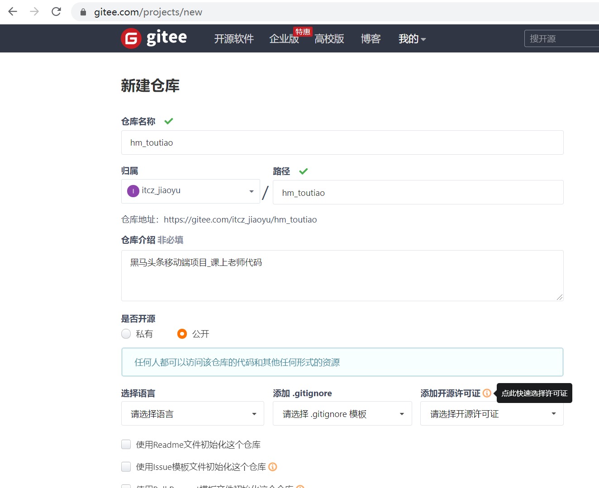
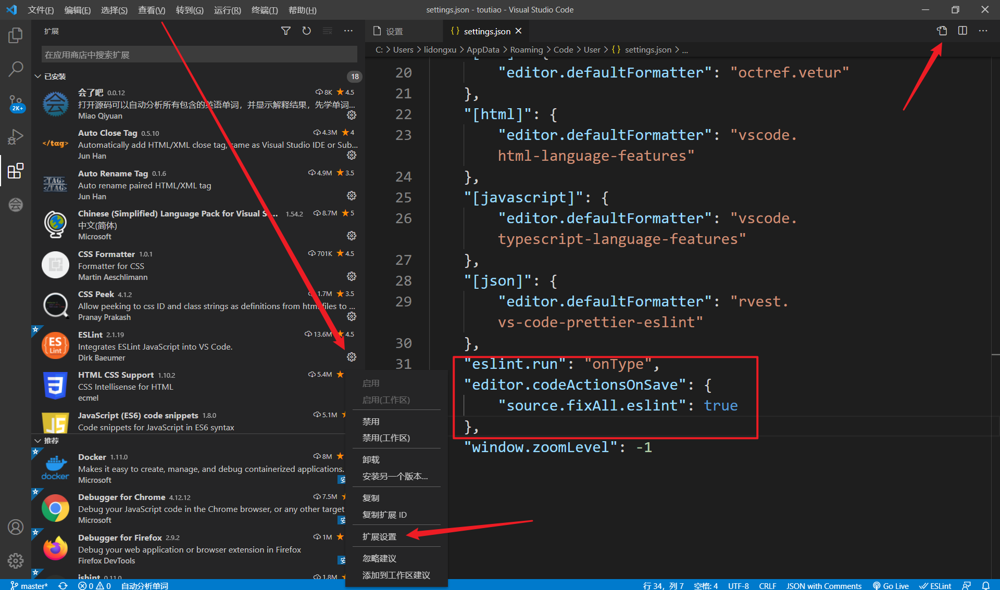
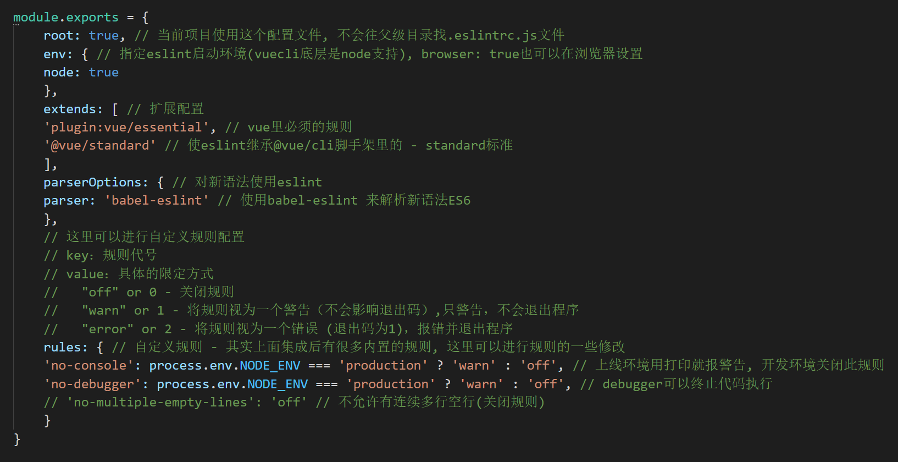
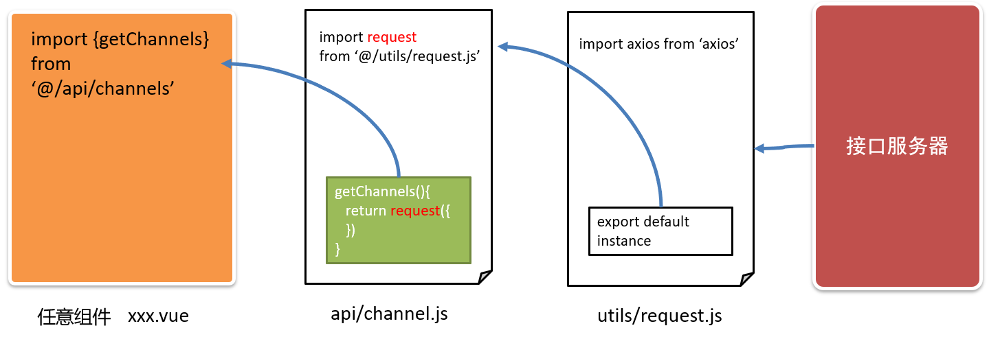
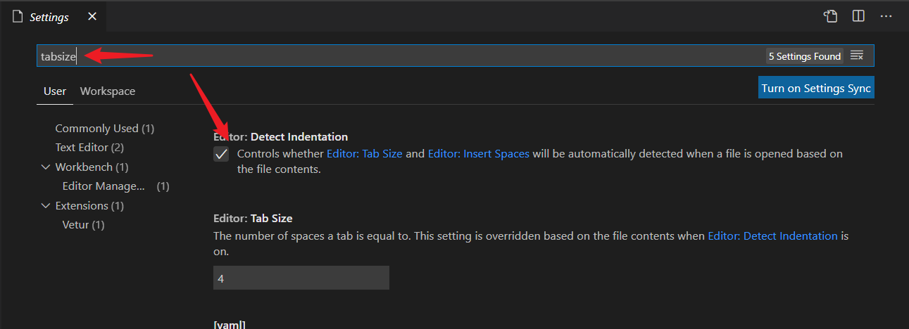

# 项目开始和登录

## 今日学习目标

- 搭建项目的结构
- 完成登录部分功能

## 1.项目 技术点

### 目标

- 了解项目需求

### 项目介绍

- 黑马头条(极客园)移动端是一个 IT 资讯移动 web 应用，有着和**今日头条**类似的资讯浏览体验。
- 主要功能：资讯列表、标签页切换，文章举报，频道管理、文章详情、关注功能、点赞功能、评论功能、搜索功能、登录功能、个人中心、编辑资料、小思同学
- 黑马头条可打包成一款移动 APP，后期结合 H5+可在 Dcloud 打包成一款体验较好的手机应用。
- 项目在线浏览地址: http://123.57.109.30:4005/dist/

### 项目包介绍

生产环境的包

| 包名             | 概念            |
| ---------------- | --------------- |
| vue              | 核心 vue        |
| vuex             | 状态管理插件    |
| vue-router       | 路由管理插件    |
| axios            | 网络请求插件    |
| vant             | 移动组件库      |
| socket.io-client | 即时通讯库      |
| amfe-flexible    | flexiblejs 适配 |

开发环境的包

| 包名            | 概念                                       |
| --------------- | ------------------------------------------ |
| babel           | ES 语法转换器                              |
| less            | css 预处理器                               |
| vue-cli         | vue 项目脚手架包                           |
| postcss         | css 语法转换器(后处理器)                   |
| postcss-pxtorem | 把 px 自动转 rem 插件(需要配合 webpack 用) |

打包 App

- Hbuilder 开发工具内, DCLOUD 功能一键打包

### 项目技术点介绍

- vuejs 中
  - $nextTick 使用 (vue 更新 DOM 是异步的)
  - 组件通信 (父, 子传递)
  - async 和 await 用法
  - keep-alive 组件缓存
- vuex
  - actions 中发 ajax 请求
  - actions 的返回值问题
- vue-router
  - 懒加载 (对打包以后首页加载速度有提高)
- axios
  - 请求和响应拦截器
  - 封装请求工具方法 (代码分层)
- vant
  - 对组件使用更熟悉
  - 掌握使用和查阅文档的能力
- socket.io-client
  - http 协议复习 (请求报文和响应报文)
  - 与 ajax 区别
  - ajax 和 socket 之间的选择
- amfe-flexible
  - 移动端 rem 适配

### 项目预计收获

1. 自我学习能力
2. 理解项目流程
3. 排错解决能力 (有错误, 对代码也要知道为什么)
   - 标签结构/样式问题 - 看 Elements 控制台
   - JS 逻辑问题 - 学会 console 打印调试变量值
   - 网络问题 - 看 network
4. 快乐和开心, 总结沉淀经验
   - 在完成开发任务后, 建议写博客(不强制)

### 小结

1. 我们要做一个什么东西?

   - 移动端的项目, 资讯类的

2. 项目大概用到哪些技术点?

3. 为什么做项目?

   - 巩固技术知识

   - 项目需求和流程(思想)

   - 锻炼写代码和学习能力

   - 锻炼排错能力

## 2.项目 创建

### 目标

- 用@vue/cli 包, 创建脚手架项目

### 步骤

1. 创建项目 (建议使用 cmd 终端)

   ```js
   vue create hmtt
   ```

2. 采用自定义方式去创建项目

   > 上下箭头切换, 回车确认, 空格选中

   ```js
   ? Please pick a preset:
     Default ([Vue 2] babel, eslint)
     Default (Vue 3 Preview) ([Vue 3] babel, eslint)
   > Manually select features
   ```

3. 手动选择特性

   Babel, Router, Vuex, CSS Pre-processors, Linter

   ```js
   ? Please pick a preset: Manually select features
   ? Check the features needed for your project:
    (*) Choose Vue version
    (*) Babel
    ( ) TypeScript
    ( ) Progressive Web App (PWA) Support
    (*) Router
    (*) Vuex
   >(*) CSS Pre-processors
    (*) Linter / Formatter
    ( ) Unit Testing
    ( ) E2E Testing
   ```

4. 版本 Vue2.x

   ```js
   ? Choose a version of Vue.js that you want to start the project with (Use arrow keys)
   > 2.x
     3.x (Preview)
   ```

5. 路由是否使用 history 模式：不采用

   

6. css 预处理器: 使用 less

   

7. eslint 语法风格：Standard (一定)

   

8. 检查节点：保存时检查，提交时检查 (提交时可以不选)


9. 存储插件配置位置：单独放在不同的文件中

   

10. 接下来，它会问你是否要保存前面的设置作为预设方案，以便后续创建其它项目时直接使用。

    - 你可以选择 N(不保存)

    - 如果选择 Y, 保存, 以后就可以一键完成以上步骤

      > 如果以后不需要的预设名字, 可以找到 C:\Users\电脑名字, 下的.vuerc 找到预设名字, 删除预设配置项

11. 经过长长的等待，创建完毕, 进入文件夹, 启动项目


### 小结

1. 如何创建项目?

   - vue create 项目文件夹名

2. 选择哪种预设?

   - 自定义模板

3. 什么叫预设?

   - 生成的脚手架项目里都有什么东西

## 3.项目 git 存储

### 目标

- git 命令巩固
- 项目版本管理
- 创建远程仓库
- 本地仓库推送上去

### 新项目 本地仓库

1. 创建本地仓库

   > 脚手架项目, 默认有个 git 本地仓库, 可以覆盖它/删除.git 文件夹自己创建

   ```js
   git init
   ```

2. 暂存和提交

   ```js
   git add .
   git commit -m '提交的说明'
   ```

   > 注意: 会在本地.git 文件夹里, 有一次本地的提交记录

### 新项目 远程仓库

1. 代码保存到远程

   - gitee.com 网站注册账号并且登录
   - gitee.com 网站创建仓库

   

2. 根据网站的命令操作(已有本地仓库)

   ```bash
   git remote add origin git仓库地址(自己去网页看)
   git push -u origin master
   ```

> 只有第一次需要 -u origin master, 以后直接 git push

4. 上传成功可以看到这里

   > 如果公司自己 git 服务器, 么有网页, 需要 git log 看提交记录

   

### 以后提交和推送

> 本地开发代码, 变化后

- 先本地提交保存(暂不保存到远程仓库上)

  ```js
  git add .
  git commit -m '提交说明,一定要写清楚,方便以后回滚'
  ```

- 要推送到远程的话才执行这句

  ```js
  git push
  ```

### 克隆和拉取

> 如需远程 git 仓库里代码, 需要克隆或拉取代码下来

- 第一次克隆下来

  - 注意: http/https 开头的地址, 需要账号密码才能克隆/推送
  - 注意; git@开头的地址, 需要 ssh 秘钥文件配置好, 才能免账号密码克隆/推送

  ```js
  git clone 远程git仓库地址
  ```

- 多人协同开发一个项目, 别人推送了, 以后直接拉取更新即可

  > 如果提示有冲突, 打开代码, 找到对方商量合并冲突

  ```js
  git pull
  ```

### 小结

1. git 有什么作用?

   可以管理代码的版本(没提交一个功能可以有个记录, 随时可以回退)

2. 本地仓库和远程仓库区别?

   本地仓库存在本地文件夹(.git)内记录

   远程仓库需要联网才能推送代码上去

## 4.ESLint 介绍

### 目标

- 了解 ESLint 的作用
- 能判断 ESLint 的错误

### ESLint 是什么

[ESLint](http://eslint.cn/) 是一个代码检查工具，用来检查你的代码是否符合指定的规范

- 例如: = 的前后必须有一个空格
- 例如: 函数名后面必须有空格
- 例如: await 必须用用在 async 修饰的函数内
- 例如: ==必须转换成 3 个等
- ........

### ESLint 的好处

- 在写代码过程中, 检查你代码是否错误, 给你`小黑屋`提示

- ESLint 可以约束团队内代码的风格统一

> `ESLint是法官, Standard是法律`

### ESLint 的规范

规范文档: http://www.verydoc.net/eslint/00003312.html

规范文档 2: https://standardjs.com/rules-zhcn.html

规范文档 3: http://eslint.cn/docs/rules/

### ESLint 使用

在代码里随便多写几个回车, ESLint 会跳出来`刀子嘴`, `豆腐心`的提示你.

在 webpack 开发服务器终端 / 浏览器 => 小黑屋


> eslint 是来帮助你的。心态要好，有错，就改。

把第 4 步规则名字, 复制到上面规范里查找违反了什么规则 / 根据第三步提示修改

### 小结

1. 什么是 ESLint?

   代码检查工具

2. 为什么要使用 ESLint?

   规范我们写代码的格式, 看着整洁 / 团队内成员风格统一

3. ESLint 在哪里生效?

   webpack 开发服务器+ESLint 配置检查

## 5.ESLint 在 VSCode 中使用

### 目标

- 每次运行后, 才看到 ESLint 报错, 很累吧?
- 边写代码, VSCode 就提示 ESLint 规则?

### ESLint 插件

1. 下载这个插件到 vscode 中

   

==2. 非常非常非常重要==

一定要把脚手架工程, 作为 vscode**根目录**, 因为 eslint 要使用配置文件.eslintrc

3. 一定要配置插件监测的时机, 修改 ESLint 插件配置

   

   不用管别的, 把红框的放在{}内即可

   ```js
   "eslint.run": "onType",
   "editor.codeActionsOnSave": {
   	"source.fixAll.eslint": true
   }
   ```

> 更多的规则可以参考这里: https://www.cnblogs.com/jiaoshou/p/12218642.html

### ESLint 插件修复

- 随便文件里多敲击几个回车, vscode 报错提示, 证明 ESLint 插件开始工作
- ctrl + s 报错下是否能自动修复部分问题, 可以, 证明 ESLint 插件开始工作

> ==如果不工作, 看下面扩展资料==

### 自定义规则

在.eslintrc.js 文件中, 可以调整规则(团队内可以自定义自己一套)



rules 是一个对象，以键值对的格式来约定规则：

- 键名是规则名
- 值是这条规则的具体说明。最常见的有 off,warn,error

### 小结

1. ESLint 在哪 2 个地方分别检查代码?

   VSCode 里工作和 webpack 开发服务器也检查

2. ESLint 插件有什么功能?

   VSCode 编码时, 提示, 保存还可以自动修复大部分问题

## 6.项目 目录结构

### 目标

- 认识工作目录
- 默认生成目录不满足我们开发结构

### 删除默认配置

1. 清空 src/views/App.vue 中的默认内容, 留个框

   ```vue
   <template>
     <div>黑马头条移动版</div>
   </template>
   ```

2. 删除默认生成的文件

   - components/HelloWorld.vue
   - views/Home.vue
   - views/About.vue

3. 修改一下路由配置 - 留下框

   - src/router/index.js

   ```js
   import Vue from 'vue'
   import VueRouter from 'vue-router'

   Vue.use(VueRouter)

   const routes = [
     // 删除掉
   ]

   const router = new VueRouter({
     routes,
   })

   export default router
   ```

### 新增文件夹

在 src 目录下中补充创建以下目录：

- /api/index.js ： 存储请求函数模块
- /styles: 样式文件模块
- /utils: 工具函数模块

```sh
├── node_modules # 安装的包
├── public	# 静态资源托管目录
│   ├── favicon.ico
│   └── index.html
└── src	# 源码
    ├── api	#请求接口封装模块
    	└── index.js #封装请求方法
    ├── assets	#资源目录
    ├── components	#组件目录
    ├── router	#路由模块
    	└── index.js #路由对象
    ├── store	#Vuex容器模块
    	└── index.js #store对象
    ├── styles #样式目录
    ├── utils  #工具模块目录
    ├── views  #视图组件目录
    ├── App.vue	#根组件
    └── main.js	#入口文件
├── .browserslistrc # 浏览器的约定
├── .editorconfig #对本项目要用到编辑器的约定
├── .eslintrc.js #eslint
├── .gitignore # git的忽略设置
├── babel.config.js	#babel配置文件
├── package-lock.json	#npm相关文件
├── package.json	#npm相关文件
└── README.md	#项目说明文件
```

### 小结

1. api 文件夹的作用?

   - 统一管理网络请求方法

2. utils 文件夹的作用?

   - 定义工具方法的地方

## 7.项目 Vant 组件库

### 目标

- 黑马头条项目 - 基于 Vant 组件库开发

### 移动端组件库

PC 端也有独特的组件库, 例如后面学习的 element-ui

有赞团队推出的 Vant 组件库

其他移动端组件库

- vux
- mint

### 引入 vant 组件库

1. 下载 vant 组件库

   ```js
   yarn add vant
   ```

2. 根据文档指引, 配置按需引入

   https://vant-contrib.gitee.io/vant/#/zh-CN/quickstart#yin-ru-zu-jian

   > 如果上面打不开用这个地址试试: https://youzan.github.io/vant/#/zh-CN/home

3. 下载插件

   ```js
   yarn add babel-plugin-import -D
   ```

4. 在 babel.config.js-添加如下配置

   ```js
   module.exports = {
     // ...省略了其他
     plugins: [
       [
         'import',
         {
           libraryName: 'vant',
           libraryDirectory: 'es',
           style: true,
         },
         'vant',
       ],
     ],
   }
   ```

5. 改了 src 以外的文件, 要重启本地开发服务器

### 小结

1. vant 组件库按需加载是什么意思?

   只需要引入某个组件而不是全部, 组件对应样式文件也会自动引入

## ==8.项目 移动端适配==

### 目标

- 复习适配方案
- 脚手架项目集成 postcss 翻译 css 代码

### 适配方案选型

1. PC 端一般都是 1:1 用 px 还原 UI 设计图, 靠内容撑开高度
2. 移动端一般都是 rem 单位进行适配

### 适配步骤

1. 下载 amfe-flexible

   > 根据网页宽度, 设置 html 的 font-size

   ```js
   yarn add amfe-flexible
   ```

2. 到 main.js 引入

   ```js
   import 'amfe-flexible'
   ```

3. 下载 postcss 和postcss-pxtorem@5.1.1

   > postcss: 后处理 css, 编译翻译 css 代码
   >
   > postcss-pxtorem: 把 css 代码里所有 px 计算转换成 rem

   ```js
   yarn add postcss postcss-pxtorem@5.1.1
   ```

4. 根目录下创建 postcss.config.js 文件

   > 对 postcss 进行设置

   ```js
   module.exports = {
     plugins: {
       'postcss-pxtorem': {
         // 能够把所有元素的px单位转成Rem
         // rootValue: 转换px的基准值。
         // 编码时, 一个元素宽是75px，则换成rem之后就是2rem
         rootValue: 37.5,
         propList: ['*'],
       },
     },
   }
   ```

   > 37.5 是如何得来的?
   >
   > UI 移动端设计图宽度 375px, 而 flexible.js 会/10, 设置 html 的 font-size 为 37.5

### 小结

1. 移动端适配选择哪种?

   rem + flexible.js

2. flexible.js 作用是什么?

   js 代码里获取网页宽度 / 10 设置 html 的 font-size 的值(px 单位)

3. 代码里 px 如何自动转换 rem?

   postcss 和 postcss-pxtorem 插件

## 9.项目 封装 axios 函数

### 目标

- 基于 axios 进行二次封装
- 统一配置, 便于管理

### 步骤

1. 下载 axios

   ```js
   yarn add axios
   ```

2. 创建 utils/request.js

   ```js
   // 基于 axios 封装的请求模块
   import ajax from 'axios'

   // 新建一个新的axios实例
   const axios = ajax.create({
     baseURL: 'http://123.57.109.30:8000', // 基地址
   })

   // 导出自定义函数, 参数对象解构赋值
   export default ({ url, method = 'GET', params, data, headers }) => {
     return axios({
       url: url,
       method: method,
       params: params,
       data: data,
       headers: headers,
     })

     // 以后换库, 只需要改这里, 逻辑页面不用动, 保证代码的复用性和独立性(高内聚低耦合)
     //   return $.ajax({
     //     url: url,
     //     type: method,
     //     data: data,
     //     header: headers
     //   })
   }
   ```

### 小结

1. 为何要二次封装 axios 函数?

   为了让我们的代码更加灵活, 统一管理

2. axios.create 作用?

   创建返回一个新的 axios 函数对象

## 10.项目 封装接口方法

### 目标

- 统一管理请求的接口

### 步骤

api/index.js 定义各种接口方法

请求所有频道数据地址: `/v1_0/channels`

```js
// 接口方法, 只负责调用一个接口, 返回一个Promise对象
export const allChannelListAPI = () => {
  return request({
    url: '/v1_0/channels',
  })
}
```

### 测试

在 main.js 中导入过来, 尝试发起一个请求

```js
import { allChannelListAPI } from '@/api'
async function myFn() {
  const res = await allChannelListAPI()
  console.log(res) // 后台返回的频道数据
}
myFn()
```

> ==测试完, 就删除 main.js 这段代码, 以后在 vue 页面使用, 这里只是测试==

### 小结

1. 为何要封装接口方法?

   还是为了方便管理

2. 网络请求相关的代码分了几层呢?

   任意组件(消费), api/index.js(秘书), utils/request.js(车), 接口服务器(本地/后台-数据提供商)

   

## 11.项目 try 和 catch

### 目标

- 如何捕获 await 错误情况

### 复习

1. await 用于取代 then 函数, 等待 Promise 成功结果提取在原地
2. await 无法获取 Promise 失败的结果, 一旦失败 Promise 错误直接抛出到控制台

### 解决方案

使用 JS 里内置语法, try+catch

语法:

```js
/*
try {
	// 可能会报错的代码(例如await)
} catch (err) {
  // promise内抛出的错误，直接进入这里
	// try里代码报错, 捕捉到这里执行
}
*/
```

具体代码

```js
import { allChannelListAPI } from '@/api'
async function myFn() {
  try {
    const res = await allChannelListAPI()
    console.log(res) // 后台返回的频道数据
  } catch (err) {
    console.error(err)
  }
}
myFn()
```

### 小结

1. await 可以提取错误的结果吗?

2. 如何能捕捉到 await 后面 Promise 的错误结果?

   使用 try+catch 块

## 12.登录 页面和路由

### 目标

- 创建登录页面 vue 文件
- 登录页面路由

### 步骤

1. src/views/Login/index.vue - 作为登录页面 - 先随意弄写标签显示

   ```vue
   <template>
     <div>
       <h1>登录页面</h1>
     </div>
   </template>

   <script>
   export default {
     name: 'Login',
   }
   </script>

   <style lang="less" scoped></style>
   ```

2. src/router/index.js - 添加登录的路由规则

   ```js
   import Login from '@/views/Login'

   const routes = [
     {
       path: '/',
       redirect: '/login',
     },
     {
       path: '/login',
       component: Login,
     },
   ]
   ```

3. 别忘了路由给挂载点, 在 App.vue 中

   ```vue
   <template>
     <div>
       <router-view></router-view>
     </div>
   </template>

   <script>
   export default {}
   </script>
   ```

4. 打开页面测试下, 是否能显示登录页面

### 小结

1. 路由的 redirect 是什么意思?

   切换路由路径的值 - 重新匹配路由

## 13.登录 导航组件

### 目标

- 根据 UI 设计图, 铺设登录页面

  

### vant 组件使用

1. 在 main.js - 引入 Vant 组件 - NavBar 导航 - 全局注册

   ```js
   import { NavBar } from 'vant'
   Vue.use(NavBar)
   ```

2. 在 Login/index.vue - 使用头部导航组件

   ```vue
   <template>
     <div>
       <van-nav-bar title="黑马头条-登录" />
     </div>
   </template>
   ```

### ==样式修改==

> 运行后, 找到组件, 渲染标签的类名, 直接覆盖样式

- **class 类名覆盖**

  > 运行后, 找到组件标签的类名, 编写相同类名覆盖

  ```less
  .van-nav-bar {
    background: #007bff;
  }

  /* /deep/ 就是把data-v-hash值选择器写到类名的前面 */
  /deep/ .van-nav-bar__title {
    color: white;
  }
  ```

### 小结

1. 为何不直接给组件设置 class?
   - 因为组件属性虽然是 class, 但是也要看组件是否支持才可以
2. 如何选中深层标签?
   - /deep/ 属性后台选择器

## 14.登录 组件定制

### 目标

- 组件样式修改
- 查阅文档, 定制组件

### 方式 1

vant 组件配置 - **less 变量配置**

vant 定制文档: https://vant-contrib.gitee.io/vant/#/zh-CN/theme

1. babel.config.js 修改配置

   ```js
   module.exports = {
     presets: ['@vue/cli-plugin-babel/preset'],
     plugins: [
       [
         'import',
         {
           libraryName: 'vant',
           libraryDirectory: 'es',
           // 指定样式路径
           style: name => `${name}/style/less`,
         },
         'vant',
       ],
     ],
   }
   ```

2. vue.config.js - 修改配置 (让 webpack 打包时, less 变量被覆盖)

   ```js
   module.exports = {
     css: {
       loaderOptions: {
         less: {
           modifyVars: {
             // 直接覆盖变量
             'nav-bar-background-color': '#007bff',
             'nav-bar-title-text-color': 'white',
             // 或者可以通过 less 文件覆盖（文件路径为绝对路径）
             // hack: `true; @import "your-less-file-path.less";`,
           },
         },
       },
     },
   }
   ```

3. 一定要重启 webpack 开发服务器, 然后观察效果

### 方式 2

vant 组件配置 - **less 文件**

1. src/styles/cover.less - vant 定制 less 变量统一在这管理

   ```less
   // NavBar导航
   @nav-bar-background-color: #007bff;
   @nav-bar-title-text-color: white;
   ```

2. vue.config.js - 注释变量, 放开引入文件路径

   ```js
   // 不要手动写绝对路径, 用代码来动态获取, 绝对地址
   const path = require('path')
   // console.log(__dirname) // 当前文件, 所在文件夹, 的绝对路径
   // 盘符:/......../工程名字, 后面自己拼接 src/styles/cover.less
   module.exports = {
     css: {
       loaderOptions: {
         less: {
           modifyVars: {
             // 直接覆盖变量
             // 'nav-bar-background-color': '#007bff',
             // 'nav-bar-title-text-color': 'white',
             // 或者可以通过 less 文件覆盖（文件路径为绝对路径）
             hack: `true; @import "${path.resolve(__dirname, 'src/styles/cover.less')}";`,
           },
         },
       },
     },
   }
   ```

3. 一定要重启 webpack 开发服务器, 然后观察效果

### 小结

1. 如何自定义组件样式?

   方式 1: 运行后找到类名, 覆盖它

   方式 2: 使用官网文档的配置方式, 覆盖原来默认样式

## 15.登录 表单组件

### 目标

- 表单组件的使用

- 表单组件正则校验

  

### 步骤

1. 引入表单组件, 在 main.js 中全局注册

   ```js
   import { Form, Field, Button } from 'vant'
   Vue.use(Form)
   Vue.use(Field)
   Vue.use(Button)
   ```

2. 在 Login/index.vue 使用组件, 定义变量, 和表单校验

   ```vue
   <template>
     <div>
       <van-nav-bar title="黑马头条 - 登录" />
       <van-form @submit="onSubmit">
         <van-field
           v-model="formLogin.mobile"
           type="tel"
           label="手机号"
           placeholder="请输入手机号"
           required
           :rules="[{ required: true, message: '请填写手机号', trigger: 'onChange', pattern: /^1[3456789]\d{9}$/ }]"
         />
         <van-field
           v-model="formLogin.code"
           type="password"
           label="密码"
           placeholder="请输入密码"
           required
           :rules="[{ required: true, message: '请填写密码', trigger: 'onChange', pattern: /^\d{6}$/ }]"
         />
         <div style="margin: 16px;">
           <van-button block type="info" native-type="submit">登录</van-button>
         </div>
       </van-form>
     </div>
   </template>

   <script>
   export default {
     name: 'Login',
     data() {
       return {
         formLogin: {
           mobile: '13888888888',
           code: '246810', // 默认只能用246810后台规定了
         },
       }
     },
     methods: {
       onSubmit() {},
     },
   }
   </script>
   ```

### ==小结(手机号正则)==

1. 判断手机号的正则怎么写?

   /^11 位校验$/

## 16.登录 调用接口

### 目标

- 调用登录接口

### 接口方法

1. api/index.js - 定义登录接口方法

   ```js
   // 用户 - 登录
   export const loginAPI = ({ mobile, code }) => {
     return request({
       url: '/v1_0/authorizations',
       method: 'POST',
       data: {
         mobile,
         code,
       },
     })
   }
   ```

2. 在 Login/index.vue 引入调用

   ```js
   import { loginAPI } from '@/api'

   async onSubmit () {
       try {
           const res = await loginAPI(this.formLogin)
           const { token, refresh_token } = res.data.data
           console.log(token);
           console.log(refresh_token);
       } catch (err) {
           console.error(err)
       }
   }
   ```

3. 打开网页登录测试一下, 观察打印和 network 是否正常

### ESLint 规则修改

我们想要使用\_方式定义变量名

```js
rules: {
    'no-console': process.env.NODE_ENV === 'production' ? 'warn' : 'off',
    'no-debugger': process.env.NODE_ENV === 'production' ? 'warn' : 'off',
    'camelcase': 'off' // 关闭_定义变量的检查
}
```

一定要重启 vscode 和 webpack 开发服务器才会生效

### 小结

1. 登录流程是什么?

   收集表单值

   调用接口方法

   调用 axios 发起请求

   请求具体 url 传递参数给后台

   拿到返回结果打印/提示

## ==17.登录 按钮优化==

### 目标

- 防止用户多次点击登录按钮

### 标签准备

1. 给按钮设置 loading 状态和 disabled 禁用

   ```vue
   <van-button round block type="info" native-type="submit" :loading="isLoding" :disabled="isLoding" loading-text="程序员拼命加载ing...">登录</van-button>

   <script>
   export default {
     data() {
       return {
         // ...省略其他
         isLoding: false, // 加载状态
       }
     },
   }
   </script>
   ```

2. 在网络请求开始的时候 isLoading = true

3. 在网络请求结束的时候 isLoading = false

   ```js
   async onSubmit () {
       this.isLoading = true
       try {
           const res = await loginAPI(this.formLogin)
           const { token, refresh_token } = res.data.data
           Notify({ type: 'success', message: '登录成功' })
           this.isLoading = false
       } catch (err) {
           Notify({ type: 'warning', message: '手机号或密码错误' })
           this.isLoading = false
       }
   }
   ```

### 小结

1. 为何要限制按钮点击?

   - 防止用户疯狂点击, 在网速慢的时候, 禁用按钮效果好

2. 什么时候开始禁用, 什么时候放开?

   - 网络请求触发开始禁用

   - 网络请求成功/失败, 都把禁用放开

## 18.登录 结果到 vuex

### 目标

- token 和 refresh_token 保存起来

### 定义

1. 在 store/index.js 的框里定义 state 和 mutations

   ```js
   import Vue from 'vue'
   import Vuex from 'vuex'
   Vue.use(Vuex)
   export default new Vuex.Store({
     state: {
       token: '',
       refresh_token: '',
     },
     mutations: {
       setToken(state, token) {
         state.token = token
       },
       setRefreshToken(state, refreshToken) {
         state.refresh_token = refreshToken
       },
     },
   })
   ```

2. 定义 actions 方法

   > 进行网络请求

   ```js
   import { loginAPI } from '@/api'

   actions: {
       async asyncLoginAction (store, val) {
           try {
               const res = await loginAPI(val)
               const { token, refresh_token } = res.data.data
               store.commit('setToken', token)
               store.commit('setRefreshToken', refresh_token)
               return Promise.resolve(res) // 返回成功的Promise对象
           } catch (err) {
               return Promise.reject(err) // 返回失败的Promise对象
           }
       }
   }
   ```

3. 在 Login/index.vue 调用 actions 方法, 发送登录请求

4. 继承 Notify 通知方法, 给用户登录提示

   > actions 的方法会返回一个 Promise 对象

   ```js
   import { mapActions } from 'vuex'
   import { Notify } from 'vant'

   methods: {
       ...mapActions(['asyncLoginAction']),
       async onSubmit () {
         try {
           await this.asyncLoginAction(this.formLogin)
           Notify({ type: 'success', message: '登录成功' })
         } catch (err) {
           Notify({ type: 'warning', message: '手机号或密码错误' })
         }
       }
     }
   ```

5. 重新登录, 观察调试工具 vuex 里是否有值

## 19.登录 结果持久化

### 目的

- 把 token 和 refresh_token 值保存到浏览器中

### 修改

1. 在 store/index.js 中, 保存给 vuex 时, 给本地存一份

   ```js
   mutations: {
       setToken (state, token) {
           state.token = token
           localStorage.setItem('token', token)
       },
       setRefreshToken (state, refreshToken) {
           state.refresh_token = refreshToken
           localStorage.setItem('refresh_token', refreshToken)
       }
   }
   ```

2. state 里取值, 默认值也要从本地取

   ```js
   state: {
       token: localStorage.getItem('token') || '', // 前面有值用前面的, 前面要是null, 就用后面的
       refresh_token: localStorage.getItem('refresh_token') || ''
   }
   ```

3. 再次重新登录, 观察 vuex 和本地是否有值, 就代表成功

4. 刷新网页, 观察 vuex 是否有默认值, 从本地获取的, 有就代表成功

### 小结

1. token 和 refresh_token 存在哪了?

   vuex 里一份, localStorage 里一份

2. 以后如何使用这 2 份数据?

   代码里操作 vuex 的, vuex 负责保存到本地, 和从本地获取

## 扩展:ESLint 插件不工作

### ctrl+s 保存, 不自动格式化

1. vscode**根目录**下必须直接是有.eslintrc.js 文件

2. ESLint 插件是否安装, 配置文件写的是否正确?

3. 如果右下角有这个图表点击后选择 AnyWhere, 会变成 V 对号, 如果没有略过此步

   

### 自动缩进

1. 与其他的美化代码插件冲突了

   禁用/卸载如下插件 (或者类似功能的插件)

   

   

2. 关闭 vscode 自动格式化功能

   vscode 文件 -> 首选项 -> 设置 -> 搜索

   

   vscode 文件 -> 首选项 -> 设置 -> 搜索

   

### 一保存, 单引又变双引

> 如果没有这个现象, 不用设置, 略过

在 ESLint 插件, JSON 文件配置里

```js
"vetur.validation.template": false, // 把 vetur 扩展的 template 格式化去掉
```
