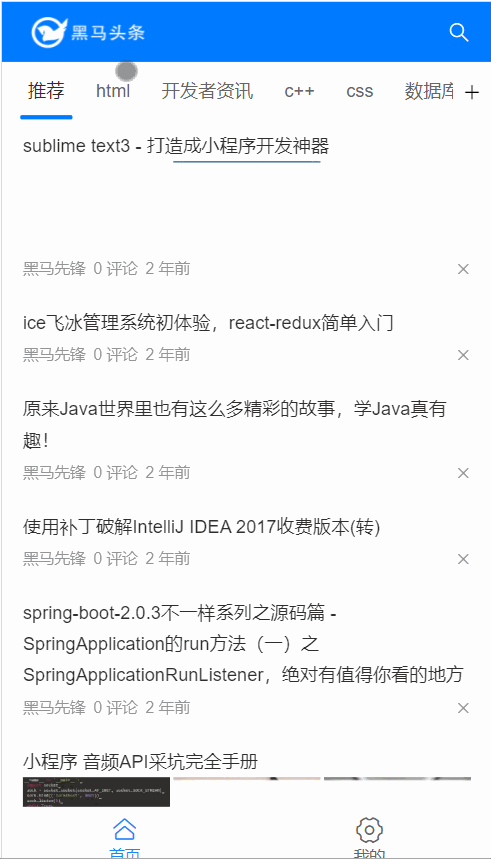
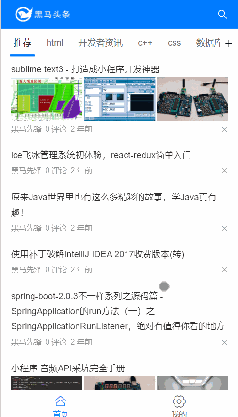
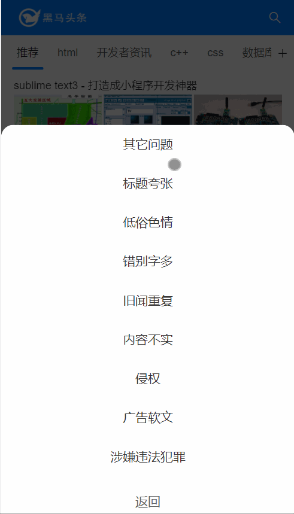
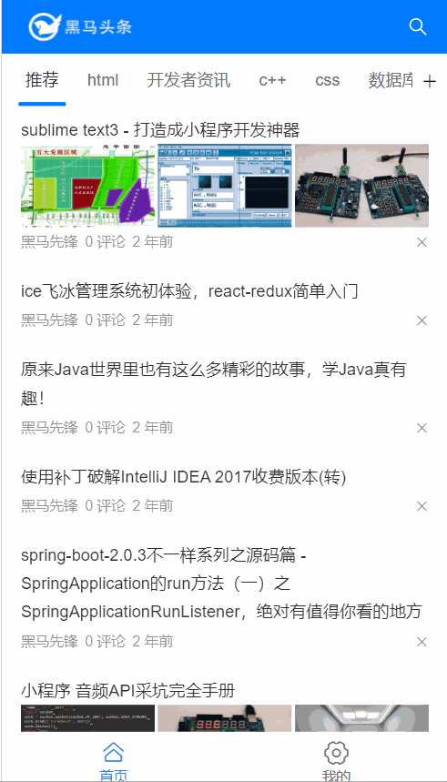
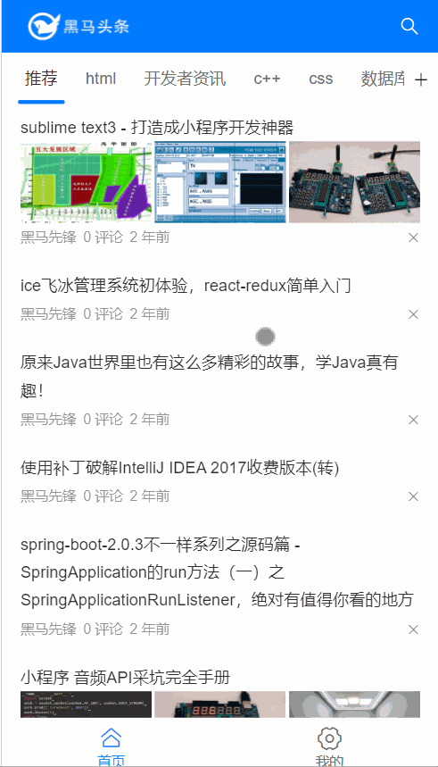
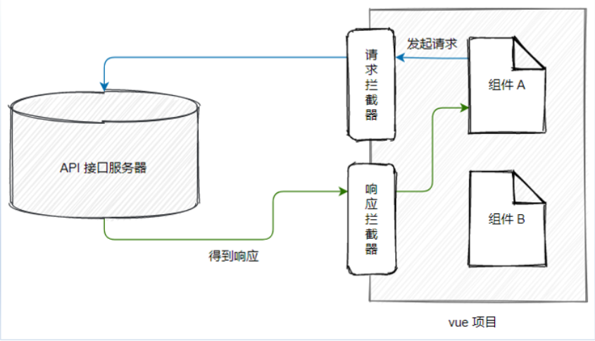
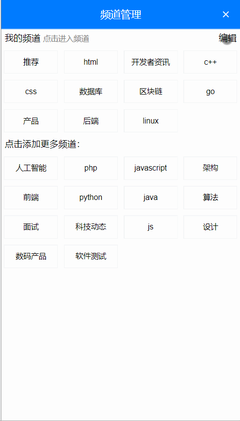
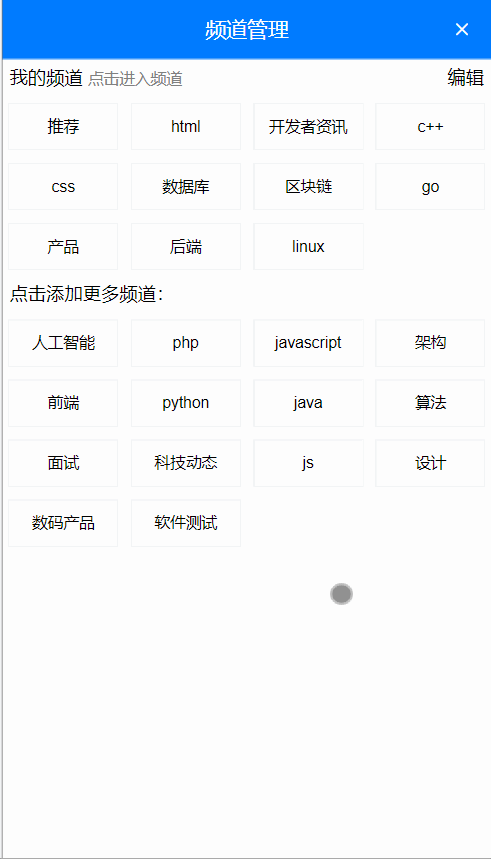
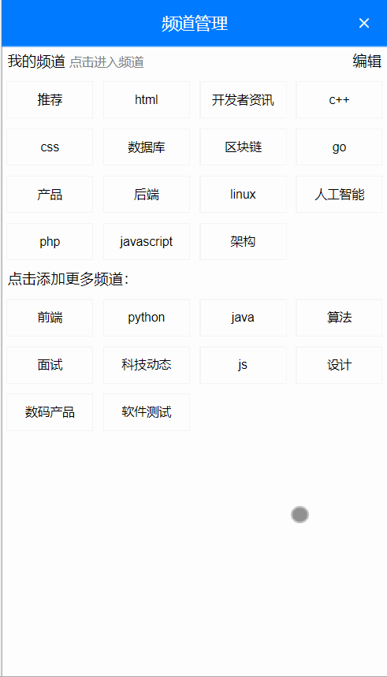
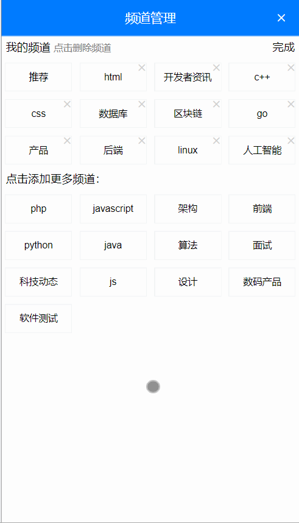

# 反馈操作和频道管理

## 今日学习目标

- 完成反馈面板铺设和使用
- 学习 axios 请求和响应拦截器
- 完成频道管理

## 1.反馈 一级面板铺设

### 目标

- 点击 x 按钮-出现一级反馈面板

  

### 分析

1. 找到类似组件 - vant 中的 ActionSheet 动作面板

2. main.js 中注册

   ```js
   import { ActionSheet } from 'vant'

   Vue.use(ActionSheet)
   ```

3. 在 ArticleItem.vue 中使用

   ```vue
   <template>
     <div>
       <!-- 一条文章单元格并列 -->
       <!-- 反馈面板 -->
       <van-action-sheet v-model="show" :actions="actions" @select="onSelect" />
     </div>
   </template>
   <script>
   export default {
     data() {
       return {
         show: false,
         actions: [{ name: '不感兴趣' }, { name: '反馈垃圾内容' }, { name: '拉黑作者' }],
       }
     },
     methods: {
       // 反馈面板点击事件
       onSelect() {},
     },
   }
   </script>
   ```

4. 发现出来的不全, 分析 DOM 层级结构, 调整挂载位置, 给 van-action-sheet 设置

   ```vue
   <van-action-sheet v-model="show" :actions="actions" @select="onSelect" get-container="body" />
   ```

5. 补充取消按钮 文字

   ```vue
   <van-action-sheet v-model="show" :actions="actions" @select="onSelect" get-container="body" cancel-text="取消" />
   ```

6. 点击 x 反馈按钮, 显示反馈面板

   ```vue
   <van-icon name="cross" @click="onCloseClick" />

   <script>
   methods: {
       // 点击了叉号按钮
       onCloseClick () {
           // 展示动作面板
           this.show = true
       }
   }
   </script>
   ```

### 小结

1. 明确目标, 找到组件, 微调整使用

## 2.反馈 二级面板铺设

### 目标

- 一级面板<反馈其他问题>点击

- 切换数据源显示二级面板内容

  

### 步骤

1. 只要切换 actions 数组的值即可

2. 不想散落在逻辑页面里, 所以在 api/report.js 定义 2 个变量

   ```js
   export const firstActions = [{ name: '不感兴趣' }, { name: '反馈垃圾内容' }]

   export const secondActions = [
     {
       value: 0,
       name: '其它问题',
     },
     {
       value: 1,
       name: '标题夸张',
     },
     {
       value: 2,
       name: '低俗色情',
     },
     {
       value: 3,
       name: '错别字多',
     },
     {
       value: 4,
       name: '旧闻重复',
     },
     {
       value: 6,
       name: '内容不实',
     },
     {
       value: 8,
       name: '侵权',
     },
     {
       value: 5,
       name: '广告软文',
     },
     {
       value: 7,
       name: '涉嫌违法犯罪',
     },
   ]
   ```

3. 在 ArticleItem.vue 中引入使用

   ```js
   import { firstActions, secondActions } from '@/api/reports'

   data(){
       return {
           // ...省略其他
           actions: firstActions
       }
   }
   ```

4. 点击反馈面板切换数据

   ```js
   onSelect (action) {
       // action绑定的数据对象, index是索引
       if (action.name === '反馈垃圾内容') {
           // 证明点击的是反馈垃圾内容
           this.actions = this.secondActions
       }
   }
   ```

### 小结

1. 面板数据切换的思想是什么?
   - actions 是反馈面板要展示的数据
   - 点击切换不同数据即可

## 3.反馈 返回一级面板

### 目标

- 一级和二级面板来回切换

- 取消按钮的 2 个文字和状态

  

### 思路

1. 点击<反馈垃圾内容>切换 actions 数据为 secondActions
2. 下面文字显示返回
3. 点击返回(不能关闭), 而是切换 actions 数据为 firstActions
4. 下面文字显示取消

### 步骤

1. 定义变量 cancelText 设置底部文字(注意只是显示的文字而已)

2. 绑定取消事件(无论显示取消/返回文字)底部按钮点击都触发

   ```vue
   <van-action-sheet v-model="show" :actions="actions" @select="onSelect" get-container="body" :cancel-text="cancelText" />

   <script>
   data () {
     return {
       show: false,
       actions: firstActions,
       cancelText: '取消' // 底部按钮文字
     }
   },
   methods: {
     // 反馈面板点击事件
     onSelect (action) {
       if (action.name === '反馈垃圾内容') {
         this.actions = secondActions
         this.cancelText = '返回' // 修改底部按钮显示文字
       }
     }
   },
   </script>
   ```

3. 监测取消事件, 阻止弹窗关闭

   ```vue
   <van-action-sheet v-model="show" :actions="actions" @select="onSelect" get-container="body" :cancel-text="cancelText" @cancel="onCancel" />

   <script>
   methods: {
       // 取消事件
       onCancel () {
         if (this.cancelText === '返回') {
           this.actions = firstActions
           this.cancelText = '取消'
           this.show = true // 点返回不要让弹窗关闭, 点取消文字按钮, 弹窗默认关闭
         }
       }
   }
   </script>
   ```

## 4.反馈 不感兴趣

### 目标

- 调用接口

  

### 步骤

1. 查看接口文档 - 定义反馈不喜欢文章 api/index.js

   ```js
   // 文章 - 不感兴趣
   export const articleDislikeAPI = ({ target }) => {
     return request({
       url: '/v1_0/article/dislikes',
       method: 'POST',
       data: {
         target: target,
       },
       headers: {
         Authorization: 'Bearer ' + store.state.token,
       },
     })
   }
   ```

2. 在 ArticleItem.vue 中, 点击不感兴趣文章, 传递文章 id 给 ArticleList 页面

   ```js
   // 反馈面板点击事件
   onSelect (action) {
       if (action.name === '反馈垃圾内容') {
           this.actions = secondActions
           this.cancelText = '返回'
       } else if (action.name === '不感兴趣') {
           this.$emit('dislike', this.obj)
           this.show = false // 关闭弹窗
       }
   }
   ```

3. 在 ArticleList.vue 中, 绑定 dislike 事件和 dislikeFn 方法

4. 弄个 Notify 通知框, 提示用户反馈结果

   ```js
   import { articleDislikeAPI } from '@/api'
   import { Notify } from 'vant'

   // 反馈(不感兴趣)
   async dislikeFn (obj) {
       try {
           await articleDislikeAPI({
               target: obj.art_id
           })
           Notify({ type: 'success', message: '反馈成功' })
       } catch (err) {
           Notify({ type: 'warning', message: '反馈失败-联系程序员' })
       }
   }
   ```

### 小结

1. 为何这次 await 左边不接受结果

   - 只要没报错, 就代表反馈成功, 而且要响应数据也无用

## 5.反馈 举报文章

### 目标

- 在上个例子基础上

- 点击举报类型调用接口

  

### 步骤

1. api/index.js - 定义接口方法

   ```js
   // 文章 - 举报
   export const articleReportsAPI = ({ target, type, remark }) => {
     return request({
       url: '/v1_0/article/reports',
       method: 'POST',
       data: {
         target: target,
         type: type,
         remark: remark,
       },
       headers: {
         Authorization: 'Bearer ' + store.state.token,
       },
     })
   }
   ```

2. ArticleItem.vue 触发父级@reports 事件, 传反馈的文章对象出来和反馈类型

   ```js
   // 反馈面板点击事件
   onSelect (action) {
       if (action.name === '反馈垃圾内容') {
           this.actions = secondActions
           this.cancelText = '返回'
       } else if (action.name === '不感兴趣') {
           this.$emit('dislike', this.obj)
           this.show = false
       } else { // 这里就是二级反馈
           this.$emit('reports', this.obj, action.value) // 外面需要反馈类型的值
           this.actions = firstActions
           this.show = false
       }
   },
   ```

3. 在 ArticleList.vue 里引入接口, 和@reports 事件方法使用

   ```js
   import { articleReportsAPI } from '@/api'

   // 反馈(举报)
   async reportsFn (obj, type) {
       try {
           await articleReportsAPI({
               target: obj.art_id,
               type: type,
               remark: '就是其他问题'
           })
           Notify({ type: 'success', message: '举报成功' })
       } catch (err) {
           Notify({ type: 'warning', message: '举报失败' })
       }
   }
   ```

### 小结

1. 为什么要传 action.value 出去?

   因为接口要使用, 我就要想尽一切办法给他

## ==6.axios 响应拦截器==

### 目标

- 什么是响应

- 什么是 axios 的响应拦截器

  

### 场景

- 在响应回来后, 马上执行响应拦截器函数

- 例如: 判断是否错误 401, 统一进行权限判断

  ```js
  // 添加响应拦截器
  axios.interceptors.response.use(
    function (response) {
      // 当状态码为2xx/3xx开头的进这里
      // 对响应数据做点什么
      return response
    },
    async function (error) {
      // 响应状态码4xx/5xx进这里
      // 对响应错误做点什么
      // console.dir(error)
      if (error.response.status === 401) {
        // 身份过期
        // token续签方式1:  去登录页重新登录, token无用, 清掉-确保路由守卫if进不去
        store.commit('setToken', '')
        router.push({ path: '/login' })
      }

      return Promise.reject(error)
    }
  )
  ```

### 小结

1. 响应拦截器什么时候执行?
   - 在响应回来以后
2. 什么时候进响应拦截器成功, 什么时候进失败?
   - 2xx/3xx 开头的响应状态码进入成功
   - 4xx/5xx 开头的响应状态码进入失败

## ==7.axios 请求拦截器==

### 目标

- 什么是请求
- 什么是 axios 的请求拦截器

### 场景

- 在发起请求之前, 最后对要发送的请求配置对象进行修改

- 例如: 如果本地有 token, 携带在请求头给后台

  ```js
  // 添加请求拦截器
  axios.interceptors.request.use(
    function (config) {
      // 在发送请求之前做些什么, 如果vuex里有token携带在请求头中
      if (store.state.token.length > 0 && config.headers.Authorization === undefined) {
        // 发起请求之前, 把token携带在请求头上(表明自己身份)
        config.headers.Authorization = 'Bearer ' + store.state.token
      }
      return config
    },
    function (error) {
      // 对请求错误做些什么
      return Promise.reject(error)
    }
  )
  ```

- 所有 api 接口里以后暂时不用自己携带 Headers+Token 了

### 小结

1. 请求拦截器时候时候执行?
   - 在发起请求最后一刻执行

## 8.频道管理 +号准备

### 目标

- +标签准备和样式

  

### 步骤

1. 标签准备

   ```vue
   <!-- Tab 标签页 -->
   <!-- ...省略其他代码 -->

   <!-- 编辑频道图标 -->
   <van-icon name="plus" size="0.37333334rem" class="moreChannels" />
   ```

2. 样式美化

   ```less
   // 设置 tabs 容器的样式
   /deep/ .van-tabs__wrap {
     padding-right: 30px;
     background-color: #fff;
   }

   // 设置小图标的样式
   .moreChannels {
     position: fixed;
     top: 62px;
     right: 8px;
     z-index: 999;
   }
   ```

### 小结

1. 准备图标 icon 组件
2. 调整样式

## 9.频道管理 弹出层标签

### 目标

- 频道页面弹出层标签

  

### 步骤

1. 寻找类似的组件 - vant 组件库叫 popup 组件

2. main.js 中注册 popup 组件

   ```js
   import { Popup } from 'vant'

   Vue.use(Popup)
   ```

3. 单独创建 Home/ChannelEdit.vue - 频道编辑组件

   > 需要用到的组件, 不要忘了全局注册

   ```vue
   <template>
     <div>
       <!-- 弹出层的头部区域 -->
       <van-nav-bar title="频道管理">
         <template #right>
           <van-icon name="cross" size="0.37333334rem" color="white" />
         </template>
       </van-nav-bar>
       <!-- 我的频道 -->
       <div class="my-channel-box">
         <div class="channel-title">
           <span
             >我的频道
             <span class="small-title"> 点击进入频道 </span>
           </span>
           <span>编辑</span>
         </div>
         <!-- 我的频道列表 -->
         <van-row type="flex">
           <van-col span="6">
             <div class="channel-item van-hairline--surround">
               名字
               <!-- 删除的徽标 -->
               <van-badge color="transparent" class="cross-badge">
                 <template #content>
                   <van-icon name="cross" class="badge-icon" color="#cfcfcf" size="0.32rem" />
                 </template>
               </van-badge>
             </div>
           </van-col>
         </van-row>
       </div>

       <!-- 更多频道 -->
       <div class="more-channel-box">
         <div class="channel-title">
           <span>点击添加更多频道：</span>
         </div>
         <!-- 更多频道列表 -->
         <van-row type="flex">
           <van-col span="6">
             <div class="channel-item van-hairline--surround">名字</div>
           </van-col>
         </van-row>
       </div>
     </div>
   </template>

   <script>
   export default {}
   </script>

   <style scoped lang="less">
   .van-popup,
   .popup-container {
     background-color: transparent;
     height: 100%;
     width: 100%;
   }

   .popup-container {
     display: flex;
     flex-direction: column;
   }

   .pop-header {
     height: 90px;
     background-color: #007bff;
     color: white;
     text-align: center;
     font-size: 14px;
     position: relative;
     .title {
       width: 100%;
       position: absolute;
       bottom: 15px;
     }
   }

   .pop-body {
     flex: 1;
     overflow: scroll;
     padding: 8px;
     background-color: white;
   }

   .my-channel-box,
   .more-channel-box {
     .channel-title {
       display: flex;
       justify-content: space-between;
       font-size: 14px;
       line-height: 28px;
       padding: 0 6px;
     }
   }

   .channel-item {
     font-size: 12px;
     text-align: center;
     line-height: 36px;
     background-color: #fafafa;
     margin: 5px;
   }

   /*删除的微标 */
   .cross-badge {
     position: absolute;
     right: -3px;
     top: 0;
     border: none;
   }

   /*提示文字 */
   .small-title {
     font-size: 10px;
     color: gray;
   }
   </style>
   ```

4. 在 Home/index.vue 引入注册使用

   ```vue
   <template>
     <div>
       <!-- 头部标签 -->
       <!-- 频道部分 -->
       <!-- 编辑频道图标 -->

       <!-- 弹出层组件 -->
       <van-popup v-model="show" class="edit_wrap">
         <!-- 弹出层的主体区域 -->
         <channel-edit></channel-edit>
       </van-popup>
     </div>
   </template>

   <script>
   import ChannelEdit from './ChannelEdit.vue'

   export default {
     data() {
       return {
         show: false, // 编辑频道弹出层显示
       }
     },
     components: {
       ChannelEdit,
     },
   }
   </script>
   ```

5. 准备变量 show, 点击按钮处弹窗

   ```vue
   <van-icon name="plus" size="0.37333334rem" class="moreChannels" @click="show = true" />
   ```

6. 美化样式: 让弹出层占满屏幕

   > ==不要选择, van_popup 类名, 因为反馈的弹出层也会变大==

   ```less
   /* 频道编辑弹出层铺满屏幕 */
   .edit_wrap {
     width: 100%;
     height: 100%;
   }
   ```

7. 补充使用组件 Row, Col, Badge, main.js 中注册

   ```js
   import { Row, Col, Badge } from 'vant'

   Vue.use(Badge)
   Vue.use(Row)
   Vue.use(Col)
   ```

8. 点击弹出层 x, 关闭

   - ChannelEdit 内向父传事件, 影响 show 的值

   - Home/index.vue 内

     ```vue
     <!-- 弹出层的主体区域 -->
     <channel-edit @close="show = false"></channel-edit>
     ```

   - ChannelEdit.vue 内

     ```vue
     <van-nav-bar title="频道管理">
         <template #right>
     <van-icon name="cross" size="0.37333334rem" color="white" @click="$emit('close')"/>
         </template>
     </van-nav-bar>
     ```

### 小结

1. ChannelEdit.vue 页面 - 是弹出层内容组件
2. van-popup 组件是弹出层, 内嵌 ChannelEdit 组件

## 10.频道管理 数据准备

### 目标

- 更多频道 = 所有频道 - 我的频道

### 步骤

1. 最开始定义过获取所有频道接口方法

2. 也定义过用户已选频道接口方法

3. 获取数据, 设置到变量上

   > 在 ChannelEdit 页面内, 首页把用户已选频道传入

   ```js
   import { allChannelListAPI } from '@/api'
   export default {
     data() {
       return {
         allChannelList: [], // 所有频道
       }
     },
     props: {
       userChannelList: {
         type: Array,
         default: () => [],
       },
     },
     async created() {
       const res = await allChannelListAPI()
       console.log(res)
       this.allChannelList = res.data.data.channels
     },
   }
   ```

   ```vue
   <channel-edit :userChannelList="channelList" @close="show = false"></channel-edit>
   ```

4. ChannelEdit 内设置计算属性 - 提取未选中的频道数据

   ```js
   computed: {
       unChannelList () {
         return this.allChannelList.filter(obj => {
           const index = this.userChannelList.findIndex(obj2 => obj2.id === obj.id)
           if (index === -1) return true
         })
       }
     }
   ```

5. 在 Home/ChannelEdit.vue 编辑频道组件上, 对应标签位置, 循环 name 使用即可

   ```vue
   <!-- 我的频道列表 -->
   <van-row type="flex">
       <van-col span="6" v-for="obj in userChannelList" :key="obj.id">
           <div class="channel-item van-hairline--surround">
               {{ obj.name }}
               <!-- 删除的徽标 -->
               <van-badge color="transparent" class="cross-badge">
                   <template #content>
   					<van-icon
                         name="cross"
                         class="badge-icon"
                         color="#cfcfcf"
                         size="0.32rem"
                         />
                   </template>
               </van-badge>
           </div>
       </van-col>
   </van-row>


   <!-- 更多频道 -->
   <div class="more-channel-box">
       <div class="channel-title">
           <span>点击添加更多频道：</span>
       </div>
       <!-- 更多频道列表 -->
       <van-row type="flex">
           <van-col span="6" v-for="obj in unChannelList" :key="obj.id">
               <div class="channel-item van-hairline--surround">{{ obj.name }}</div>
           </van-col>
       </van-row>
   </div>
   ```

### 小结

1. 如何从全部数据中, 筛选出已选数组里没有的

   遍历全部数据中的每个, 去已选数组里查找, 找不到收集起来

## 11.频道管理\_编辑状态

### 目标

- 点击编辑按钮

- 显示文字切换

- x 微标切换

  

### 步骤

1. 点击编辑按钮实现文字切换

   ```vue
   <div class="channel-title">
       <span>我的频道
           <span class="small-title">
               {{ isEdit ? '点击删除频道' : '点击进入频道' }}
           </span>
       </span>
       <span @click="isEdit = !isEdit">{{ isEdit ? '完成' : '编辑' }}</span>
   </div>

   <script>
   export default {
     data() {
       return {
         isEdit: false, // 控制编辑状态
       }
     },
   }
   </script>
   ```

2. 设置 x 微标显示与否

   > ==推荐频道上不能出现 x==

   ```vue
   <!-- 删除的徽标 -->
   <van-badge color="transparent" class="cross-badge" v-if="isEdit">
       <template #content>
   		<van-icon
             name="cross"
             class="badge-icon"
             color="#cfcfcf"
             size="0.32rem"
             />
       </template>
   </van-badge>
   ```

### 小结

1. 如何在 2 个状态之间来回切换?

   点击事件, 让变量取反再赋予回去

## 12.频道管理 新增频道

### 目标

- 新增频道效果

  

### 步骤

1. 更多频道选择 - 绑定点击事件

   ```vue
   <van-col span="6" v-for="obj in unChannelList" :key="obj.id" @click="addFn(obj)">
       <div class="channel-item van-hairline--surround">
           {{ obj.name }}
       </div>
   </van-col>

   <script>
   methods: {
       // 新增频道
       addFn (obj) {
           if (this.isEdit === true) {
               this.$emit('addChannel', obj)
           }
       }
   }
   </script>
   ```

2. 回传要添加的频道 obj 对象, 子传父

   ```js
   addFn (item) { // 新增频道
       if (this.isEdit === true) { // 编辑状态
           this.$emit('add', item)
       }
   }
   ```

3. 在 Home/index.vue, 接收后, 添加到频道数组里

   > 注意: 你有计算属性, 所以引用变量改变, 未选频道自动重新计算

   ```vue
   <!-- 弹出层的主体区域 -->
   <channel-edit :userChannelList="channelList" @close="show = false" @addChannel="addChannelFn"></channel-edit>

   <script>
   methods: {
       // 添加频道
       addChannelFn (obj) {
           this.channelList.push(obj)
       }
   },
   </script>
   ```

### 小结

1. 为何要子传父?

   因为数组在父页面中, 而且不违反相当数据流规范

## 13.频道管理 更新频道

### 目标

- 新增 / 删除后同步给后台

### 步骤

1. 定义更新频道接口方法

   ```js
   // 频道 - 更新已选
   export const updateChannelAPI = ({ channels }) => {
     return request({
       url: '/v1_0/user/channels',
       method: 'PUT',
       data: {
         channels: channels,
       },
     })
   }
   ```

2. 在 Home/index.vue - 引入接口方法, 在新增频道方法中

   > 把数据预处理成后台想要的格式, 直接把频道数组更新覆盖给后台

   ```js
   import { updateChannelAPI } from '@/api'

   async editFn (obj, index, type) { // 编辑频道
       if (type === 'add') {
           this.list.push(obj)
       }
       const arr = this.list.filter((obj) => { return obj.id !== 0 }) // 先过滤掉id为0的推荐频道, 把剩余的数组返回
       console.log(arr)

       const resultList = arr.map((item, index) => {
           const newObj = { ...item } // 浅拷贝(让对象和原数组脱离关系)
           newObj.seq = index + 1
           delete newObj.name // 删除对象里name键值对
           return newObj
       })
       // map会收集每次遍历return的值形成一个新数组
       console.log(resultList)
       await updateChannelAPI({
           channels: resultList
       })
   },
   ```

### 小结

1. 什么是数据预处理?

   要在前端使用前, 可以把数据操作一下, 要给后端使用前, 也可以用 js 代码处理一下

## 14.频道管理 删除频道

### 目标

- 在编辑状态下, 点击频道删除

  

### 步骤

1. 推荐频道不允许删除, 所以单独判断一下, 不给删除频道小微标

   ```vue
   <!-- 删除的徽标 -->
   <van-badge color="transparent" class="cross-badge" v-if="isEdit && obj.name !== '推荐'">
       <template #content>
   		<van-icon
             name="cross"
             class="badge-icon"
             color="#cfcfcf"
             size="0.32rem"
             />
       </template>
   </van-badge>
   ```

2. 点击选项删除(而不是点击右上角小微标)

   ```vue
   <!-- 我的频道列表 -->
   <van-row type="flex">
      <van-col span="6" v-for="obj in tabsList" :key="obj.id" @click="removeFn(obj)">
      </van-col>
   </van-row>
   ```

3. 从 ChannelEdit.vue 传递要删除的索引到 Home/index.vue 删除频道

   > 推荐频道不能删除

   ```js
   // 删除频道
   removeFn (obj) {
       if (this.isEdit === true && obj.name !== '推荐') {
           this.$emit('removeChannel', obj)
       }
   }
   ```

4. Home/index.vue - 监听 removeChannel 事件

   ```vue
   <!-- 弹出层的主体区域 -->
   <channel-edit :userChannelList="channelList" @close="show = false" @addChannel="addChannelFn" @removeChannel="removeChannelFn"></channel-edit>
   ```

5. 把更新方法提取, 分别调用

   ```js
   methods: {
       // 添加频道
       async addChannelFn (obj) {
         this.channelList.push(obj)
         this.updateChannel()
       },
       // 统一更新频道
       async updateChannel () {
         // 先拷贝一份数组(前端页面用channelList, 后端用拷贝出的数组)
         // 数组第一层, 对象里key+value是第二层
         const newArr = this.channelList.map(obj => {
           const newObj = { ...obj }
           return newObj
         })
         // 先剔除推荐
         const index = newArr.findIndex(obj => obj.name === '推荐')
         newArr.splice(index, 1)
         // 转换字段
         newArr.forEach((obj, index) => {
           delete obj.name
           obj.seq = index + 1
         })
         // 调用接口
         await updateChannelAPI({
           channels: newArr
         })
       },
       // 删除频道
       async removeChannelFn (obj) {
         // 找到这个频道在数组下标删除
         const ind = this.channelList.findIndex(item => item.id === obj.id)
         this.channelList.splice(ind, 1)
         this.updateChannel()
       }
     },
   ```

### 小结

1. 如何区分判断推荐不能操作?

   x 标签是否显示, 只是个显示, 但是事件还在

   js 代码还是需要, 判断是否为推荐

## 15.频道管理 重置编辑状态

### 目标

- 弹出层关闭重置编辑状态

### 步骤

1. 监测弹出层关闭事件(查阅 vant 文档)

   > 绑定@closed 事件
   >
   > channel-edit 添加 ref(为了获取组件对象, 修改内部的 isEdit 变量

   ```vue
   <!-- 弹出层组件 -->
   <van-popup v-model="show" class="edit_wrap" @closed="onPopupClosed">
       <!-- 弹出层的主体区域 -->
       <channel-edit :userChannelList="channelList" @close="show = false" @addChannel="addChannelFn" @removeChannel="removeChannelFn" ref="channelEdit"></channel-edit>
   </van-popup>
   ```

2. 在 Home/index.vue - 访问到 ChannelEdit.vue 的 isEdit 变量设置为 false

   ```js
   methods: {
       // 弹层关闭-重置编辑频道状态
       onPopupClosed () {
           this.$refs.channelEdit.isEdit = false
       }
   }
   ```

### 小结

1. 父亲如何操作子组件内的变量?

   可以通过 ref 和$refs 来获取子组件对象, 然后操作子组件对象里的一切

## 16.频道管理 进入

### 目标

- 在编辑频道页面, 点击进入频道

  

### 步骤

1. 在 ChannelEdit.vue 的我的频道, 点击事件判断

   ```js
   // 删除频道
   removeFn (obj) {
       if (this.isEdit === true && obj.name !== '推荐') { // 删除频道
           this.$emit('removeChannel', obj)
       } else { // 进入逻辑
           this.$emit('changeChannel', obj)
           this.$emit('close') // 关闭弹窗
       }
   }
   ```

2. 在 Home/index.vue - 绑定@changeChannel 事件, 准备切换显示频道

   ```vue
   <channel-edit
     :userChannelList="channelList"
     @close="show = false"
     @addChannel="addChannelFn"
     @removeChannel="removeChannelFn"
     ref="channelEdit"
     @changeChannel="channgeChannelFn"
   ></channel-edit>

   <script>
   // 切换频道
      channgeChannelFn (obj) {
        this.channelId = obj.id // 传过来的频道ID, 影响tabs默认v-model的选择
      }
   </script>
   ```

### 小结

1. van-tabs 的 v-model 值改变, 自动影响 van-tab 对应内容列表出现
   - 如果 van-tab 对应 ArticleList 第一次出现会执行 created 拿到频道 id 请求数据, 铺设文章列表
   - 如果 van-tab 对应 ArticleList 以后出现, 组件不会删除重建, 继续显示原来的文章列表
