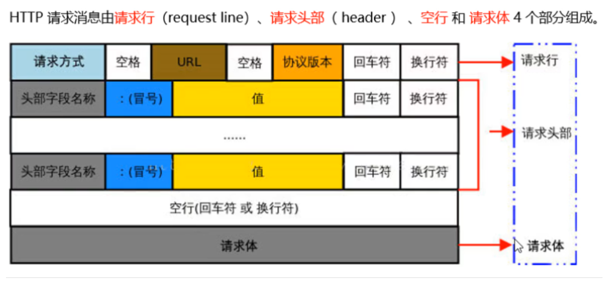
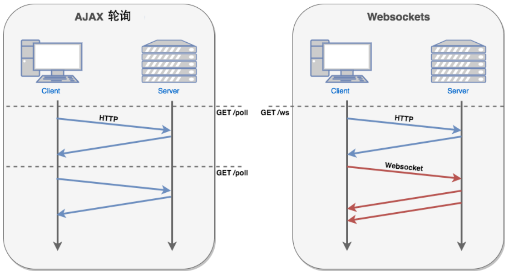
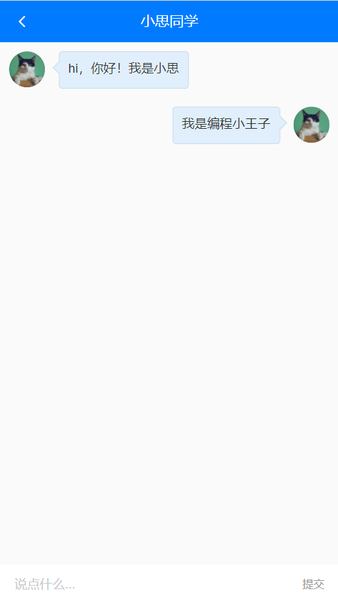
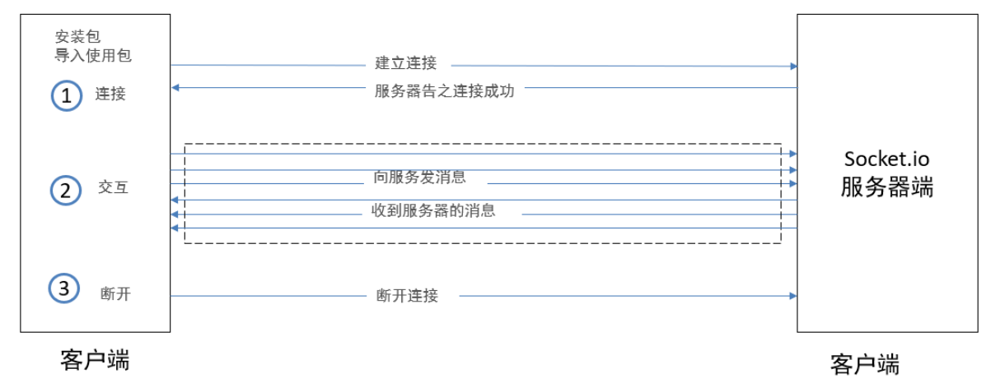
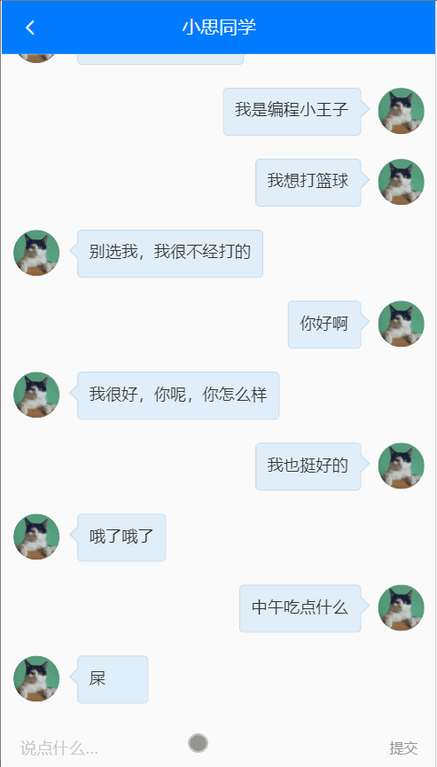

# 小思同学

## 1 http 协议复习

### 目标

- 什么是 http 协议
- 什么是请求报文和响应报文

### 讲解

1. http 中文意思: 超文本传输协议, 定义服务器和客户端的传送格式

2. 请求发送的数据包, 叫请求报文, 格式如下

   

3. 响应回来的数据包, 叫响应报文, 格式如下

   

### 缺点

- HTTP 协议：客户端与服务器建立通信连接之后
  - 服务器端只能**被动地**响应客户端的请求，==无法主动给客户端发送消息。== 一次请求才能对应一次响应

http 建议阅读: http://lidongxuwork.gitee.io/pages/computer/network/http%E5%8D%8F%E8%AE%AE.html#%E5%AD%97%E6%AE%B5%E6%80%BB%E7%BB%93

http-mdn 地址: https://developer.mozilla.org/zh-CN/docs/Web/HTTP

### 小结

~~~js
1. http 协议是客户端与服务端传输信息的格式

2. http 协议暂定一次请求对应一次响应

3. 在哪里传参给后台?
  params查询字符串query; data请求体body; headers请求头
   请求头, 请求体(json,formdata,查询字符串), url(?后面 和 url 路径上拼接)

4. 不发请求拿不到响应体

5. axios默认get请求,get可以不写
   axios内部会把参数对象转成json字符串格式发给后台,并且会自动携带请求头参数 headers: { Content-Type: 'application/json'}

6. params的对象参数名和值,axios源码会把参数和值,拼接在url?后面发送给后台,称为query查询字符串
   data的对象参数名和值,axios源码会把参数和值,拼接在请求体里发送给后台,称为body参数

7. request就相当于axios函数,在原地返回promise对象,内部包含了原声ajax请求
   return这个promise对象到逻辑页面,去那边对promise对象提取结果
~~~

## 2 即时通信介绍

### 目标

- 什么是即时通信
- ajax 是否能实现
- 即时通信实现技术

### 讲解

1. 即时通信: 即时发送和接收互联网消息等的业务

2. ajax 只能是发起请求后, 得到一次响应, 无法实现即时通信

   > 但是可模拟, 比如创建计时器, 每隔 1 秒, 自动调用一次接口, 拿到服务器要发送的数据
   >
   > 但这非常可怕
   >
   > (1): 万一服务器上没有你要的最新消息, 这次请求和响应是无意义的
   >
   > (2): 服务器为了给你做出响应, 还占用了一定内存和带宽, 很浪费

   以上技术叫计时器轮询, 迫不得已才能使用(一般用不上, 了解即可)

3. HTML5 出了一个新的技术叫 WebSocket, 可以在一个 TCP 链接上, 实现即时通信效果

   - 需要前端支持
   - 需要后端支持

### 使用场景

- 直播
  - 主播的实时画面数据, 推送到服务器上
  - 服务器主动推送视频流到所有客户端设备上(重点)
- 语音
  - 说话人声音数据流推送到服务器上
  - 服务器推送给指定的客户端设备上(重点)
- 文字聊天
  - 有一个人发送文字到服务器上
  - 服务器推送给指定/所有客户端(重点)
  - 体验下: http://123.57.109.30:4005/index2.html (多开几个窗口自己跟自己聊)

### 小结

1. 什么是即时通信?
   - 服务器能主动给客户端发送消息, 不局限于一次请求一次响应
2. ajax 是否能实现即时通信?
   - 只能模拟, 用轮询方式, 但是耗费资源, 少用
3. 如何实现即时通信?
   - 前端采用 WebSocket 协议, 也是新出的一个类
   - 后端也要提供 WebSocket 接口地址, 建立连接

## 3 webSocket 使用

### 目标

- 自己用原生 JS 实现一次 WebSocket 使用
- 前提: 一定需要一个后端服务器(支持 socket 的)

### 概念

它是一种新的技术, 前后端只要支持这种协议, ==后端可以主动向前端推送内容==

项目中使用: 做一个智能客服

Websocket 通过 HTTP/1.1 协议的 101 状态码进行握手

其实 VueCli 脚手架服务器 和 浏览器之间就建立了一个 WebSocket 通道

> 才实现的代码一改, 服务器向浏览器主动推送更新的 js 文件, 页面就自动更新了

协议对比



### 体验 前端代码

代码直接复制体验即可

> 这里后台采用: wss://echo.websocket.org 这个地址实现 socket 连接

```html
<!DOCTYPE html>
<html lang="en">
  <head>
    <meta charset="UTF-8" />
    <meta name="viewport" content="width=device-width, initial-scale=1.0" />
    <title>体验websocket</title>
    <style>
      #contanier {
        width: 500px;
        height: 400px;
        border: 2px dashed #7575e7;
        overflow-y: auto;
      }
    </style>
  </head>
  <body>
    <div id="contanier"></div>
    <!-- 1  建立连接 (拨号) -->
    <!-- 2  发消息 接消息 -->
    <!-- 3  关闭连接 -->
    <input type="text" id="message" />
    <button onclick="openWS()">建立连接</button>
    <button onclick="sendMessage()">发送消息</button>
    <button onclick="closeWS()">关闭连接</button>

    <script>
      var dom = document.getElementById('contanier')
      var inputDom = document.getElementById('message')
      var isOpen = false // 表示是否已经建立了拨号
      var ws // 别的方法 也需要使用ws
      // 打开websocket连接
      var openWS = function () {
        /// 网络上提供的一个测试websocket功能的服务器地址。
        /// 它的效果是，你向服务器发什么消息 ，它就原样回复给你。
        ws = new WebSocket('wss://echo.websocket.org') // 建立与服务器的连接

        // onopen是webSocket约定事件名
        // 当本地客户端浏览器与服务器建立连接之后，就会执行onopen的回调
        ws.onopen = function (event) {
          isOpen = true
          // 建立成功
          dom.innerHTML = dom.innerHTML + `<p>与服务器成功建立连接</p>`
        }
        //   接收消息
        // onmessage是webSocket约定事件名
        // 如果从服务器上发过来了消息，则会进入onmessage的回调
        ws.onmessage = function (event) {
          // 由于 我们先给服务器发了消息 服务器给我们回了消息
          dom.innerHTML = dom.innerHTML + `<p style='color: blue'>服务器说:${event.data}</p>`
        }
        // onclose是webSocket约定事件名
        ws.onclose = function () {
          // 此函数表示 关闭连接成功
          isOpen = false // 把状态关闭掉
          dom.innerHTML = dom.innerHTML + `<p>与服务器连接关闭</p>`
        }
      }
      //   发送消息 接收消息
      var sendMessage = function () {
        if (inputDom.value && isOpen) {
          // 发消息 要等到 连接成功才能发 而且内容不为空

          // 发消息就是send
          ws.send(inputDom.value) // 发送消息
          // 发完之后 添加到 当前视图上
          dom.innerHTML = dom.innerHTML + `<p style='color: red'>我说:${inputDom.value}</p>`
          inputDom.value = ''
        }
      }
      // 关闭连接
      var closeWS = function () {
        ws.close() // 关闭连接
      }
    </script>
  </body>
</html>
```

### 小结

1. vuecli 脚手架启动的 webpack 开发服务器, 和浏览器之间也建立着一条 socket 通道
2. WebSocket 还是基于 TCP, 但是会隔几秒发一个很小的包给后台(心跳包) 维持这段连接

## 4 socket.io 包使用

> 前端对 WebSocket 封装很好
>
> 后端对 socket 代码也封装好了

### 目标

- 后端 socket 支持
  - nodejs 的 Express 建立 web 服务器
  - nodejs 集成 socket.io 包开启后端 socket 服务
- 前端也要使用 socket.io 包使用 socket 服务
- 英文文档: https://socket.io/docs/v4/client-initialization/
- 中文文档: https://www.w3cschool.cn/socket/socket-k49j2eia.html

### 后端代码

server.js

```js
const express = require('express') // 引入express模块,当前文件夹下载
const app = express() // 实例化app服务器对象
app.use(express.static(`${__dirname}/public`)) // 设置服务器静态资源目录,目录下的文件都可以让浏览器直接访问

const http = require('http').Server(app) // 使用http模块,实例化会http服务器对象
http.listen(4005) // 设置服务器端口
const io = require('socket.io')(http) // socket.io要的http对象不是express对象,服务器上scoket服务对象

// io.on('connection') -- 固定的, 用于监测有没有人用socket服务链接我, 触发后面的函数
io.on('connection', function (socket) {
  // socket连接者对象
  // console.log('a user connected');
  socket.on('cTos', data => {
    // 谁来链接我, 我就给谁绑定一个事件叫cTos(随便), data接收的就是前端触发这个事件传递过来的聊天消息
    // io.sockets(拿到当前连接池里所有的socket对象-链接到我的所有人), emit()触发事件(前端事件叫sToC)---广播
    io.sockets.emit('sToC', data) // 把当前收到的聊天消息, 发送给所有连接着(前端)
  })
})
```

### 前端代码

index.html

```html
<!DOCTYPE html>
<html lang="en">
  <head>
    <meta charset="UTF-8" />
    <meta http-equiv="X-UA-Compatible" content="IE=edge" />
    <meta name="viewport" content="width=device-width, initial-scale=1.0" />
    <title>首页</title>
  </head>

  <body>
    <!-- 引入jquery -->
    <script src="https://cdn.jsdelivr.net/npm/jquery/dist/jquery.min.js"></script>
    <!-- 1. 引入前端的socket.io注意版本一定要跟后台对上 -->
    <script src="https://cdn.jsdelivr.net/npm/socket.io@4.1.2/client-dist/socket.io.min.js"></script>
    <div>
      <p>聊天窗口:</p>
      <hr />
      <div id="result"></div>
    </div>
    <div>
      <input type="text" placeholder="用户名" id="user" />
      <input type="text" placeholder="消息" id="msg" />
      <button id="btn">发送</button>
    </div>
    <script>
      // 2. 用io()函数链接socket服务器
      // 如果代码部署到了线上服务器, 这个localhost要换成线上的ip地址
      // 因为这个网页请求到本地浏览器上查看, 你要还是localhost那不是请求本地呢吗?
      const socket = io('ws://localhost:4005')
      $('#btn').on('click', function () {
        let user = $('#user').val()
        let msg = $('#msg').val()
        console.log(user, msg)

        // 3. socket触发后端的事件
        socket.emit('cTos', { user, msg })
      })

      socket.on('sToC', obj => {
        $('#result').append($(`<p>${obj.user} 说: ${obj.msg}</p>`))
      })
    </script>
  </body>
</html>
```

### 第三方使用

> 使用第三方公司封装的插件(SDK)

推荐 2 个比较常用的即时通信服务平台

- 环信
- 容联云

具体使用过程, 根据文档, 集成到自己项目中

### 小结

1. 可以不用原生 WebSocket 干, 使用一些包例如, socket.io 包
2. 前端要注意使用 client 名字的 js 文件
3. 也可以使用第三方服务, 快速集成功能

## 5 小思同学 页面准备

### 目标

- 创建小思同学页面和标签

- 配置路由

  

### 步骤

1. views/Chat/index.vue - 创建页面

   ```vue
   <template>
     <div class="container">
       <!-- 固定导航 -->
       <van-nav-bar fixed left-arrow @click-left="$router.back()" title="小思同学"></van-nav-bar>

       <!-- 聊天主体区域 -->
       <div class="chat-list">
         <div>
           <!-- 左侧是机器人小思 -->
           <div class="chat-item left">
             <van-image fit="cover" round src="https://img.yzcdn.cn/vant/cat.jpeg" />
             <div class="chat-pao">这里是别人说的话</div>
           </div>

           <!-- 右侧是当前用户 -->
           <div class="chat-item right">
             <div class="chat-pao">这里是我说的话</div>
             <van-image fit="cover" round src="https://img.yzcdn.cn/vant/cat.jpeg" />
           </div>
         </div>
       </div>

       <!-- 对话区域 -->
       <div class="reply-container van-hairline--top">
         <van-field placeholder="说点什么...">
           <template #button>
             <span style="font-size: 12px; color: #999">提交</span>
           </template>
         </van-field>
       </div>
     </div>
   </template>

   <script>
   export default {
     name: 'Chat',
   }
   </script>

   <style lang="less" scoped>
   .container {
     height: 100%;
     width: 100%;
     position: absolute;
     left: 0;
     top: 0;
     box-sizing: border-box;
     background: #fafafa;
     padding: 46px 0 50px 0;
     .chat-list {
       height: 100%;
       overflow-y: scroll;
       .chat-item {
         padding: 10px;
         .van-image {
           vertical-align: top;
           width: 40px;
           height: 40px;
         }
         .chat-pao {
           vertical-align: top;
           display: inline-block;
           min-width: 40px;
           max-width: 70%;
           min-height: 40px;
           line-height: 38px;
           border: 0.5px solid #c2d9ea;
           border-radius: 4px;
           position: relative;
           padding: 0 10px;
           background-color: #e0effb;
           word-break: break-all;
           font-size: 14px;
           color: #333;
           &::before {
             content: '';
             width: 10px;
             height: 10px;
             position: absolute;
             top: 12px;
             border-top: 0.5px solid #c2d9ea;
             border-right: 0.5px solid #c2d9ea;
             background: #e0effb;
           }
         }
       }
     }
   }
   .chat-item.right {
     text-align: right;
     .chat-pao {
       margin-left: 0;
       margin-right: 15px;
       &::before {
         right: -6px;
         transform: rotate(45deg);
       }
     }
   }
   .chat-item.left {
     text-align: left;
     .chat-pao {
       margin-left: 15px;
       margin-right: 0;
       &::before {
         left: -5px;
         transform: rotate(-135deg);
       }
     }
   }
   .reply-container {
     position: fixed;
     left: 0;
     bottom: 0;
     height: 44px;
     width: 100%;
     background: #f5f5f5;
     z-index: 9999;
   }
   </style>
   ```

2. 配置路由

   ```js
   import Chat from '@/views/Chat'

   {
     path: '/chat',
     component: Chat
   }
   ```

3. 点击 van-cell 单元格跳转页面

   ```vue
   <van-cell icon="chat-o" title="小思同学" is-link to="/chat" />
   ```

### 小结

1. van-cell 有 to 属性也能跳转路由

## 6 小思同学 数据获取和渲染

### 目标

- 铺设小思同学页面
- 先把固定数据铺设上去

### 步骤

1. 先在本地渲染数组 - 准备数组并循环渲染到标签上

   ```js
   export default {
     name: 'Chat',
     data() {
       return {
         word: '', // 输入框的内容
         // 所有的聊天消息
         list: [
           // 只根据 name 属性，即可判断出这个消息应该渲染到左侧还是右侧
           { name: 'xs', msg: 'hi，你好！我是小思' },
           { name: 'me', msg: '我是编程小王子' },
         ],
       }
     },
   }
   ```

2. 把数据循环到标签上, 注意判断数据是哪一边的, 给输入框绑定 v-model

   ```vue
   <template>
     <div class="container">
       <!-- 固定导航 -->
       <van-nav-bar fixed left-arrow @click-left="$router.back()" title="小思同学"></van-nav-bar>
   
       <!-- 聊天主体区域 -->
       <div class="chat-list">
         <div v-for="(obj, index) in list" :key="index">
           <!-- 左侧是机器人小思 -->
           <div class="chat-item left" v-if="obj.name === 'xs'">
             <van-image fit="cover" round src="https://img.yzcdn.cn/vant/cat.jpeg" />
             <div class="chat-pao">{{ obj.msg }}</div>
           </div>
   
           <!-- 右侧是当前用户 -->
           <div class="chat-item right" v-if="obj.name === 'me'">
             <div class="chat-pao">{{ obj.msg }}</div>
             <van-image fit="cover" round src="https://img.yzcdn.cn/vant/cat.jpeg" />
           </div>
         </div>
       </div>
   
       <!-- 对话区域 -->
       <div class="reply-container van-hairline--top">
         <van-field v-model="word" placeholder="说点什么...">
           <template #button>
             <span style="font-size:12px;color:#999">提交</span>
           </template>
         </van-field>
       </div>
     </div>
   </template>
   ```

### 小结

1. 如何区别消息是谁的?
   - 根据消息对象里 name 字段的值, 决定用哪一边 div 承载消息

## 7 小思同学 webSocket 使用

### 目标

- 继承 webSocket, 和后台建立通道

- 完成效果

  

### 步骤

1. 安装客户端 socket 的包(支持 websocket) - 内部对 websocket 进行了封装

   ```js
   yarn add socket.io-client@4.0.0
   ```

2. 在 Chat/index.vue 引入包

   ```js
   // 导入 socket.io-client 包
   import { io } from 'socket.io-client'

   // 定义变量，存储 websocket 实例
   let socket = null
   ```

3. 创建 socket 服务

   ```js
   created() {
       // ...
       // 创建客户端 websocket 的实例
       socket = io('http://toutiao.itheima.net', {
           query: {
               token: this.token
           },
           transports: ['websocket']
       })
   }
   ```

4. 监听是否连接成功

   > 只有连接内置事件执行了, 才能进行后续操作

   ```js
   created() {
     // 建立连接的事件
     socket.on('connect', () => {
       console.log('与服务器建立了连接')
     })
   }
   ```

5. 在组件销毁前, 关闭服务

   ```js
   // 组件被销毁之前，清空 sock 对象
   beforeDestroy() {
     // 关闭连接
     socket.close()

     // 销毁 websocket 实例对象
     socket = null
   },
   ```

6. 在 created 监听 socket 的消息

   ```js
   created() {
       // ...

       // 接收到消息的事件
       socket.on('message', data => {
         // 把服务器发送过来的消息，存储到 list 数组中
         this.list.push({
           name: 'xs',
           msg: data.msg
         })
       })
   },
   ```

7. 在 send 事件中, 把服务器发来的数据装到数组里

   ```js
   sendFn () {
       // 判断内容是否为空
       if (!this.word) return

       // 添加聊天消息到 list 列表中
       this.list.push({
           name: 'me',
           msg: this.word
       })
   }
   ```

8. 客户端调用 `socket.emit('message', 消息内容)` 方法把消息发送给 websocket 服务器：

   ```js
   // 向服务端发送消息
   sendFn () {
       // 判断内容是否为空
       if (!this.word) return
   
       // 添加聊天消息到 list 列表中
       this.list.push({
           name: 'me',
           msg: this.word
       })
   
       // 把消息发送给 websocket 服务器
       socket.emit('message', {
           msg: this.word,
           timestamp: new Date().getTime()
       })
   
       // 清空文本框的内容
       this.word = ''
   }
   ```

### 小结

1. vuecli 项目中下载 socket.io 包

2. 建立和服务器的 socket 连接

   > 要到连接地址和参数等注意事项

3. 与后台协商好, 发送消息和接收消息的事件名, 以及数据格式

## 8 小思同学 滚动到底部

### 目标

- 发消息和收消息, 立刻滚动到底部

  

### 步骤

1. 定义滚动到底部的方法

   ```js
   // 滚动到页面底部
   scrollToBottom () {
       // 获取到所有的聊天 Item 项
       const chatItem = document.querySelectorAll('.chat-item')
       // 获取到最后一项对应的 DOM 元素
       const lastItem = chatItem[chatItem.length - 1]
       // 调用 scrollIntoView() 方法，显示这个元素
       lastItem.scrollIntoView({
           behavior: 'smooth' // 动画平滑
       })
   }
   ```

2. 在发布消息 / 接收到消息的时候, 调用

   ```js
   this.$nextTick(() => {
     this.scrollToBottom()
   })
   ```

### 小结

1. 获取原生 DOM, 调用 scrollIntoView 方法, 让标签滚到可视窗口
2. 如果下面没有更多内容了, 是不一定会滚到头的

## 9 小思同学 存储用户头像

### 目标

- 把我的信息保存到 vuex 中
- 把信息持久化存储(否则聊天界面刷新头像就没了)

### 步骤

1. 在 vuex 中定义变量保存信息

   ```js
   import Vue from 'vue'
   import Vuex from 'vuex'

   Vue.use(Vuex)

   export default new Vuex.Store({
     state: {
       // ...
       user: JSON.parse(localStorage.getItem('user')) || {}, // 用户基本资料(默认从本地取)
     },
     mutations: {
       // ...
       setUser(state, userObj) {
         state.user = userObj
         localStorage.setItem('user', JSON.stringify(userObj))
       },
     },
   })
   ```

2. 在 User/index.vue 中, 获取后保存起来

   ```js
   methods: {
       ...mapMutations(['setToken', 'setUser']),
   },
   async created () {
   	const res = await userInfoAPI()
   	this.user = res.data.data
   	this.setUser(res.data.data)
   }
   ```

3. 既然存储到 vuex 中, 我的页面也使用

   > 逻辑页面里网络请求 => 存储 vuex 和 localStorage 中 => 映射回到逻辑页面里使用

   ```js
   import { mapState, mapMutations } from 'vuex'
   export default {
     data() {
       return {
         // user: {} // 用户对象
       }
     },
     computed: {
       ...mapState(['user']),
     },
     async created() {
       const res = await userInfoAPI()
       console.log(res)
       // this.user = res.data.data
       this.setUser(res.data.data)
     },
   }
   ```

4. 去小思同学页面使用 vuex 中的值, 使用头像

   > 定义 getters, 直接拿到 user 里的头像

   ```js
   getters: {
       userPhoto (state) {
           return state.user.photo
       }
   }
   ```

   然后在逻辑页面映射过来使用即可

   ```js
   import { mapGetters } from 'vuex'
   export default {
     computed: {
       ...mapGetters(['userPhoto']),
     },
   }
   ```

### 小结

1. 跨页面用值, 其实可以直接父传子
2. 但是为了后面跨页面使用, 做铺垫, 保存到 vuex 中
3. 如果刷新也要使用的值, 要做本地持久化存储

## 10 优化 路由 懒加载

### 目标

- 为何使用路由懒加载
- 什么是路由懒加载

### 步骤

1. 运行时, network 里禁用缓存, 观察 app.js 大小

2. 路由懒加载 - 查看文档: https://router.vuejs.org/zh/guide/advanced/lazy-loading.html

3. 使用

   ```js
   component: Login
   // 改成这个写法
   component: () => import('@/views/Login.vue')
   ```

4. 再次运行后观察 app.js 的大小

> 路由拦截器, 可以让页面不上来都被引入到 webpack 里一起打包插入到浏览器运行
>
> 等待使用时, 再去循环对应页面组件

### 小结

~~~js
/*
路由懒加载: 为了让第一个页面, 加载的app.js小一点, 打开网页快一点
思路: 把组件对应js, 分成若干个.js, 路由切换到哪个页面, 才去加载对应的.js文件
原因: webpack分析入口时, 发现router里上来就import所有页面, 所以直接打包进app.js->很大
解决: 当路由路径匹配规则时, 才现去import引入对应的组件js文件
webpackChunName注释语法, 给生成的js文件起名字
*/
~~~


1. 为何使用路由拦截器?
   - 为了让首页渲染更快
2. 什么是路由懒加载?
   - 路由规则匹配后, 再加载对应 js 代码

## 11 优化 路由 全局守卫

### 目标

- 登录成功时, 不允许切换路径进入登录页面

### 步骤

方法 1: 全局前置守卫判断

```js
router.beforeEach((to, from, next) => {
  // 有token, 不能去登录页
  // 无token, 需要用户"权限"的才需要去登录页
  if (store.state.token.length > 0 && to.path === '/login') {
    // 证明有token-已经登录了
    next(false) // 阻止跳转原地呆着
  } else {
    next()
  }
})
```

方法 2: 路由独享守卫

```js
{
    path: '/login',
    component: () => import(/* webpackChunkName: "Login" */ '@/views/Login'),
    beforeEnter (to, from, next) {
      if (store.state.token.length > 0) { // vuex里有token(代表登录过, 但是一定要注意过期和主动退出要先清除vuex和本地的token, 让其跳转登录页)
        return next(false)
      }
      next()
    }
},
```

### 小结

1. 路由守卫有很多种, 具体查阅文档
2. 重点多看看路由执行的过程和注意事项

## 12 token 续签

### 目标

- token 过期 401, 强制跳转到登录页, 清空本地和 store 中的 token 数据
- token 过期 401, 用 refresh_token 无感知的刷新一个新的 token 回来
  - 替换旧的 token 的同时, 继续上次未完成的请求. 用户体验好

### 步骤

1. 定义刷新 token 的接口方法

   ```js
   // 用户 - 更新token
   export const refreshTokenAPI = () =>
     request({
       url: '/v1_0/authorizations',
       method: 'PUT',
       headers: {
         Authorization: `Bearer ${store.state.refresh_token}`,
       },
     })
   ```

2. 在响应拦截器 401 处, 调用重新请求 token 的接口, 然后同步给 vuex 和本地

   ```js
   axios.interceptors.response.use(
     function (response) {
       return response
     },
     async function (error) {
       if (error.response.status === 401) {
         // 身份过期
         // token续签方式1:
         // store.commit('setToken', '')
         // router.push({ path: '/login' })
   
         // token续签方式2: refreshToken(用户无感知)
         store.commit('setToken', '')
         const res = await refreshTokenAPI()
         store.commit('setToken', res.data.data.token)
         // 再调用一次未完成的请求啊(用户无感知)
         // error.config 就是上一次axios请求的配置对象
         // console.dir(error.config)
         // 把新的token赋予到下一次axios请求的请求头中
         error.config.headers.Authorization = 'Bearer ' + res.data.data.token
         // return到await的地方
         return ajax(error.config)
       } else {
         return Promise.reject(error)
       }
     }
   )
   ```

### 小结

- token 过期, 强制跳转登录
- token 过期, 无感知刷新 token, 重新再发起一次请求

## 13 api 接口分文件

### 目标

- 把 api 文件打散

### 步骤

- 原因: 一个 api/index.js, 有几百行代码, 不便于管理
- 解决: 分散到多个 js 文件里, 再引入回到统一导出
  - 分散的 js 文件名, 尽量和页面模块同名, 方便查找

问题 1: 分文件后, 逻辑页面里都是从 api/index.js 导出的, 难道我们要去改逻辑代码?

解决: 在 api/index.js - 中 export \* from '分散的文件' (模块重定向)

意思: 在 api/index.js 作为入口, 从别的地方把接口倒回来同时导出给外面

> export 文档: https://developer.mozilla.org/zh-CN/docs/Web/JavaScript/Reference/Statements/export

注意; 包括 reports.js 文件也从统一出口导出, 去修改 src/components/ArticleItem 引数据位置

### 结果

api/index.js 如下

```js
export * from './reports' // 反馈列表数据
export * from './ArticleDetail' // 文章详情相关
export * from './Home' // 首页(频道)相关, 首页文章列表
export * from './Login' // 登录相关
export * from './Search' // 搜索相关
export * from './User' / 用户相关
```

### 小结

1. 分散以后, 尽量不改变原有代码
2. export \* from '模块' (导入所有并再以相同方式导出)
