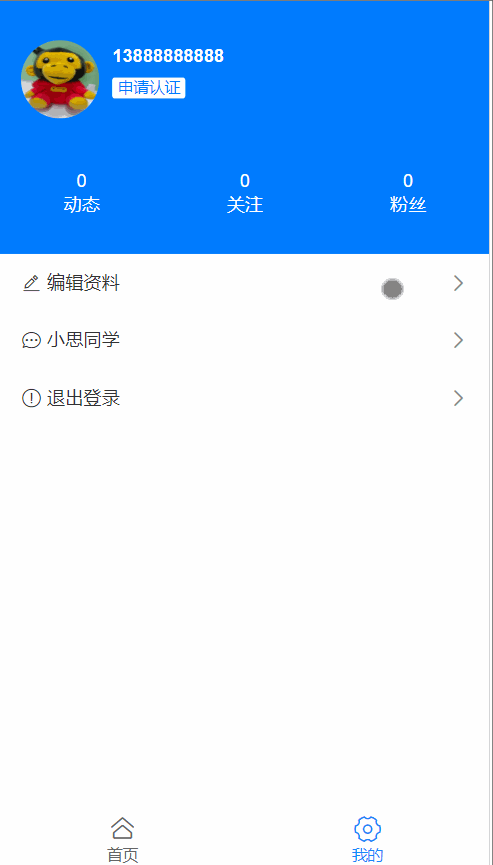
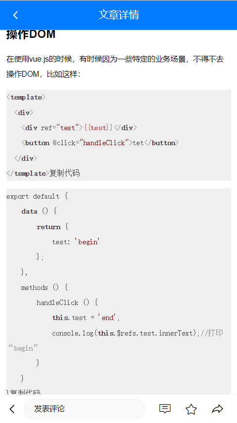
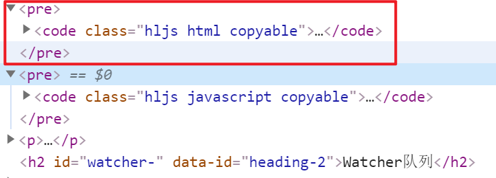
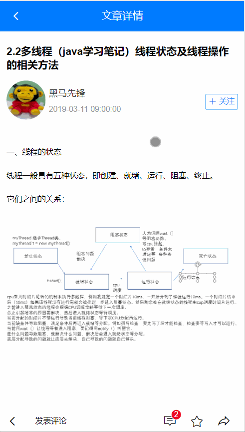
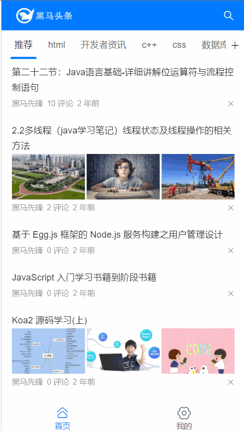

# 优化细节

## 1 优化 组件缓存

### 目标

- 防止组件路由切换时频繁创建和销毁
- 防止网络请求重复无用执行

### 步骤

组件缓存, 可以实现组件的状态保持。

结合 vue 内置的 keep-alive 组件，可以实现组件的状态保持。

官方文档地址：https://cn.vuejs.org/v2/api/#keep-alive

1. 在**App.vue**中的 router-view 外层套上一个 keep-alive 组件

   - 缓存的一级路由页面切换不被释放, 但是首页还是会重新请求数据

2. 在**Layout.vue**中的 router-view 外层套上一个 keep-alive 组件

   - 这次 Home 和 User 页面都被缓存了(二级路由也要管)

3. 但发现**搜索页面**和**详情页面**多被缓存起来了 (多次进入不同的文章, 发现都是同一个文章详情)

4. 对 router-view 使用 exclude 属性来区别, 哪些页面组件可以缓存

   > ==特别注意 exclude 里是组件的 name 名字(跟路由没什么关系)==

   ```vue
   <template>
     <div>
       <keep-alive :exclude="['ArticleDetail', 'Login', 'Search', 'SearchResult']">
         <router-view></router-view>
       </keep-alive>
     </div>
   </template>
   ```

### 小结

- 只有被切换销毁的组件, 才需要被缓存
- router-view 是他们切换时的挂载点, 套在挂载点外来缓存内部组件

## 2 优化 头像不更新问题

### 目标

- User 页面缓存了, 修改头像不更新问题

  

### 分析

1. User.vue 被缓存了, 所以改了头像回到 User 页面, created 里获取用户资料接口不会执行

   - 解决方案 1: 把 created 换成 activated 钩子函数即可

   - 解决方案 2: UserEdit.vue 修改头像成功后, 更新到 vuex 中, User 页面使用的 vuex 数据也受到更新

     1. vuex 中定义 mutations 修改头像

        ```js
        updatePhoto (state, photo) {
            state.user.photo = photo
            localStorage.setItem('user', JSON.stringify(state.user))
        }
        ```

     2. UserEdit.vue 映射, 调用传成功头像覆盖

        ```js
        import { mapMutations } from 'vuex'
        export default {
          // ...
          methods: {
            ...mapMutations(['updatePhoto']),
     
            async onFileChange(ev) {
              if (ev.target.files.length === 0) return
              const fd = new FormData()
              fd.append('photo', ev.target.files[0])
              const res = await updatePhotoAPI(fd)
              console.log(res)
              this.profile.photo = res.data.data.photo
              this.updatePhoto(res.data.data.photo) // 同步头像给vuex
            },
          },
        }
        ```

2. 引申用户名字修改也是同理的

   - vuex 中定义修改名字的 mutations

     ```js
     updateName (state, theName) {
         state.user.name = theName
         localStorage.setItem('user', JSON.stringify(state.user))
     }
     ```

   - UserEdit.vue 页面, 修改名字成功调用更新

     ```js
     import { mapMutations } from 'vuex'
     export default {
       // ...
       methods: {
         // ...
         ...mapMutations(['updatePhoto', 'updateName']), // 映射updateName方法
         async onNameDialogBeforeClose(action, done) {
           if (action === 'confirm') {
             if (/^[A-Za-z0-9\u4e00-\u9fa5]{1,7}$/.test(this.userName)) {
               await updateProfileAPI({
                 userName: this.userName,
               })
               this.profile.name = this.userName
               this.updateName(this.userName) // 同步到vuex中
               done()
             }
           }
         },
       },
     }
     ```

### 小结

1. 组件缓存, 页面切换走再回来, 不会销毁重建执行所有代码
2. 把共享数据放到 vuex, 数据改变, 所有引用的地方都会局部更新执行

## 3 优化 文章详情 代码高亮

### 目标

- 文章详情页里代码片段高亮效果

  

### 分析

1. 想要让代码高亮, 必须在**后台发布文章**时, 就要把代码分段用 pre+code 标签包裹

   

2. 前端可以通过获取这些标签名/指定类名, 分别给予相应样式

### 步骤

> 基于 highlight.js 美化详情页的代码片段

英文文档(更全): https://highlightjs.readthedocs.io/en/latest/index.html

中文文档: https://fenxianglu.cn/highlight.html

1. 下载此插件到项目中

   ==一定要带.js 名字==

   ```js
   yarn add highlight.js -D
   ```

2. 在 main.js 引入即可

   ```js
   import hljs from 'highlight.js' // hljs对象
   import 'highlight.js/styles/default.css' // 代码高亮的样式
   ```

3. 注册高亮代码-自定义指令

   ```js
   Vue.directive('highlight', function (el) {
     // 自定义一个代码高亮指令
     const highlight = el.querySelectorAll('pre, code') // 获取里面所有pre或者code标签
     highlight.forEach(block => {
       hljs.highlightElement(block) // 突出显示这些标签(以及内部代码, 会自动识别语言)
     })
   })
   ```

4. 在铺设文章详情标签使用 v-highlight 指令即可

### 小结

1. 遇到需求, 多百度解决方案
2. 看文档尝试使用解决需求

## 4 优化 文章详情 loading 效果

### 目标

- 在网络慢的时候, 可以给用户一个提示
- 在没有文章时, 给用户一个提示

### 步骤

1. 加载效果提示, vant 组件有, 找到全局注册

   ```js
   import { Loading } from 'vant'

   Vue.use(Loading)
   ```

2. 标签使用, 和内容+评论势不两立

   ```vue
   <!-- 文章加载中... -->
   <van-loading color="#1989fa">文章疯狂加载ing...</van-loading>
   <div>
       <!-- 文章信息区域 -->
       <div class="article-container">
           <!-- ... -->
       </div>
       <!-- 文章评论区域 -->
       <CommentList></CommentList>
   </div>
   ```

3. 调整 loading 标签样式, 给个 class 类名

   ```vue
   <van-loading color="#1989fa" class="loading">文章疯狂加载ing...</van-loading>

   <style>
   .loading {
     margin-top: 50px;
     text-align: center;
   }
   </style>
   ```

4. 加入判断, 加载中或者文章详情标签出现

   ```vue
   <van-loading color="#1989fa" class="loading" v-if="artObj.title === undefined">文章疯狂加载ing...</van-loading>
   <div v-else>
   	<!-- 文章信息区域 -->
   </div>
   ```

### 小结

1. loading 效果用数据任意字段判断是否有值即可

## 5 优化 登录未遂地址

### 目标

- 401 时, 自动切登录页

- 登录后回到刚才页面

  

### 步骤

1. 要点赞的时候, 401 了, 强制跳转到登录页面了, 保存未遂地址跳转到登录页面

   > 要把 tokens 续签改掉, 否则不会跳转到登录页面

   ```js
   if (error.response.status === 401) {
     // 身份过期
     // token续签方式1:  去登录页重新登录, token无用, 清掉-确保路由守卫if进不去
     store.commit('setToken', '')
     console.log(router.currentRoute.fullPath)
     router.push({ path: `/login?path=${router.currentRoute.fullPath}` })

     // token续签方式2: refreshToken(用户无感知)
     // store.commit('setToken', '')
     // const res = await refreshTokenAPI()
     // store.commit('setToken', res.data.data.token)
     // 再调用一次未完成的请求啊(用户无感知)
     // error.config 就是上一次axios请求的配置对象
     // console.dir(error.config)
     // 把新的token赋予到下一次axios请求的请求头中
     // error.config.headers.Authorization = 'Bearer ' + res.data.data.token
     // return到await的地方
     // return ajax(error.config)
   } else {
     return Promise.reject(error)
   }
   ```

2. 在 Login/index.vue, 登录后, 判断有未遂地址, 跳这里, 否则去/路径

   ```js
   // 跳转到Layout页面
   this.$router.replace({
     path: this.$route.query.path || '/layout',
   })
   ```

### 小结

1. 401 时, 携带当前路由路径到登录页
2. 登录时如果 url 有未遂地址跳转, 否则去首页

## 6 优化 图片懒加载

### 目标

- 图片标签进入视口才加载图片
- 图片 src 会调用浏览器请求图片资源

### 步骤

1. vant 组件库里有个叫 LazyLoad 指令, 在 main.js 中全局注册

   ```js
   import { Lazyload } from 'vant'

   Vue.use(Lazyload)
   ```

2. 先查看首页, 上来默认请求了多少张图片 / 点击别的频道查看

   > 注意: 有的频道图片本身就不多

3. 根据文档指示, 在 src/components/ArticleItem.vue 中, 把所有 img 的 src 换成 v-lazy 指令即可

   ```vue
   <!-- 标题区域的插槽 -->
   <template #title>
     <div class="title-box">
       <!-- 标题 -->
       <span>{{ obj.title }}</span>
       <!-- 单图 -->
       
     </div>
     <!-- 三张图片 -->
     <div class="thumb-box" v-if="obj.cover.type > 1">
       
     </div>
   </template>
   ```

4. 再次观察上来默认请求的图片个数

> 原理实现: https://developer.mozilla.org/zh-CN/docs/Web/API/IntersectionObserver
>
> 具体例子看这个: https://www.cnblogs.com/lidgblogs/p/7607582.html

### 小结

1. 图片懒加载原理是?
   - img 标签先不给 src 属性赋值
   - 等 img 标签出现在视口时, 把身上另外属性的图片地址给 src 请求

## 7 优化 自动聚焦问题

### 目标

- 用户名修改弹窗多次点击
- 只有第一次自动聚焦问题

### 分析

1. 自动聚焦依赖自定义指令 inserted 执行

   > 而 Dialog 只有第一次出现是插入到真实 DOM, 触发 inserted 方法
   >
   > 而 Dialog 以后初选是 css 层面的显示出现, 不会触发 inserted 方法

2. 解决方案

   > 给自定义指令添加 update 方法, 指定所在 DOM 更新时执行

   ```js
   import Vue from 'vue'
   // 插件对象(必须有install方法, 才可以注入到Vue.use中)
   export default {
     install() {
       Vue.directive('fofo', {
         inserted(el) {
           fn(el)
         },
         update(el) {
           fn(el)
         },
       })
     },
   }
   function fn(el) {
     if (el.nodeName === 'INPUT' || el.nodeName === 'TEXTAREA') {
       // 如果直接是input标签/textarea标签
       el.focus()
     } else {
       // 指令在van-search组件身上, 获取的是组件根标签div, 而input在标签内
       const inp = el.querySelector('input')
       const textArea = el.querySelector('textarea')
       // 如果找到了
       if (inp || textArea) {
         inp && inp.focus()
         textArea && textArea.focus()
       } else {
         // 本身也不是, 子标签里也没有
         console.error('请把v-fofo用在输入框标签上')
       }
     }
   }
   ```

### 小结

1. inserted 只有第一次指令所在标签, 插入真实 DOM 执行

## 8 优化 抽离组件注册

### 目标

- main.js 代码有些多, 分散出去

### 步骤

1. 创建 src/VantRegister.js, 把 Vant 注册的相关代码复制过来

   ```js
   import Vue from 'vue'
   import {
     NavBar,
     Form,
     Field,
     Button,
     Tabbar,
     TabbarItem,
     Icon,
     Tab,
     Tabs,
     Cell,
     List,
     PullRefresh,
     ActionSheet,
     Popup,
     Row,
     Col,
     Badge,
     Search,
     Divider,
     Tag,
     CellGroup,
     Image,
     Dialog,
     DatetimePicker,
     Loading,
     Lazyload,
   } from 'vant'
   Vue.use(Lazyload)

   Vue.use(Loading)
   Vue.use(DatetimePicker)
   Vue.use(Dialog)
   Vue.use(Image)
   Vue.use(CellGroup)
   Vue.use(Tag)
   Vue.use(Divider)
   Vue.use(Search)
   Vue.use(Badge)
   Vue.use(Row)
   Vue.use(Col)
   Vue.use(Popup)
   Vue.use(ActionSheet)
   Vue.use(PullRefresh)
   Vue.use(List)
   Vue.use(Cell)
   Vue.use(Tab)
   Vue.use(Tabs)
   Vue.use(Icon)
   Vue.use(Tabbar)
   Vue.use(TabbarItem)
   Vue.use(Form)
   Vue.use(Field)
   Vue.use(Button)
   Vue.use(NavBar)
   ```

2. 在 main.js 引入一下, 让代码执行

   ```js
   import './VantRegister'
   ```

3. 总结下模块化的 3 种使用方式
   - 按需导出和导入
   - 默认导出和导入
   - 无导出和导入

### 小结

1. vuecli 脚手架环境是基于 node+webpack 的模块化开发
2. 所以想要使用别的 js 文件, 就要导入过来

## 9 优化 首页 滚动条位置

### 目标

- 切换首页和我的页面

- 首页滚动条位置需要恢复

  

### 步骤

> ==keep-alive 不会缓存滚动条的位置的==

1. 路由对象/home, 上添加 meta 额外信息

```js
meta: { isRecord: true, top: 0 } // isRecord是否需要设置滚动位置
```

2. 给 Home 设置组件内守卫

   > 注意: 此方法与 methods 并列

```js
// 路由离开 - 触发(保存滚动位置)
beforeRouteLeave (to, from, next) {
    from.meta.top = window.scrollY
    next()
}
```

3. 在全局后置钩子设置页面滚动条

```js
// 全局后置钩子
router.afterEach((to, from) => {
  // 如果当前的路由的元信息中，isRecord 的值为 true
  if (to.meta.isRecord) {
    setTimeout(() => {
      // 则把元信息中的 top 值设为滚动条纵向滚动的位置
      window.scrollTo(0, to.meta.top)
    }, 0)
  }
})
```

## 10 优化 频道 滚动条位置

### 目标

- 明确数据结构
- tabs 切换保存当前位置
- tabs 切换后, 把位置设置

### 步骤

1. 明确数据结构, 在 Home/index.vue 定义变量

   ```js
   // “频道名称”和“滚动条位置”之间的对应关系，格式 { '推荐ID': 211, 'htmlID': 30, '开发者资讯ID': 890 }
   const nameToTop = {}
   ```

2. tabs 标签绑定 before-change 事件和方法实现

   > 向 nameToTop 添加属性和位置, 缓存起来

   ```vue
   <van-tabs v-model="channelId" animated sticky offset-top="1.226667rem" :before-change="tabBeforeChangeFn">

   <script>
   methods: {
       // 频道切换之前触发
       tabsBeforeChangeFn () {
         nameToTop[this.channelId] = window.scrollY // 先保存要被切走频道的滚动距离(一定要用哦this.channelId里存着的)
         // 只有return true才会让tabs切换
         return true
       }
   }
   </script>
   ```

3. 监测 tabs 切换后, 从 nameToTop 对象里拿到原本滚动位置设置

   ```vue
   <van-tabs v-model="channelId" animated sticky offset-top="1.226667rem"  :before-change="tabsBeforeChangeFn" @change="tabsChangeFn">
   
   <script>
   methods: {
       // 频道切换后
       tabsChangeFn (channelId) {
         // 等 DOM 更新完毕之后，根据记录的"滚动条位置"，调用 window.scrollTo() 方法进行滚动
         this.$nextTick(() => {
           window.scrollTo(0, nameToTop[channelId] || 0)
         })
       }
   }
   </script>
   ```

### 小结

1. 首先明确数据结构, 频道 id 对应滚动条值
2. 切换之前保存, 切换之后从数据结构取出对应值设置

## 11 优化 持久化存储方式

### 目标

- 封装本地持久化方法

### 步骤

1. 创建 utils/storage.js 文件, 定义 4 个方法

   ```js
   // 本地存储方式
   // 如果同时有sessionStorage和localStorage, 可以封装2份
   // 现在我只封装一种统一的方式
   export const setStorage = (key, value) => {
     localStorage.setItem(key, value)
   }
   export const getStorage = key => {
     return localStorage.getItem(key)
   }
   export const removeStorage = key => {
     localStorage.removeItem(key)
   }
   export const clearStorage = () => {
     localStorage.clear()
   }
   ```

2. 把所有使用本地存储的地方, 都统一换成这里定义的方法

   - 在 store/index.js - vuex 中使用过
   - 在 search/index.vue - 搜索页面使用过

### 小结

1. 为了防止项目中本地存储方式切换, 统一封装
2. 以后万一切换, 可以直接修改 utils/storage.js 内的真正实现即可

## 12 优化 封装统一便于扩展的 Notify

### 目标

- 万一以后项目的通知框要统一更换

### 步骤

1. 新建 utils/Notify.js 文件

   ```js
   // 基于vant组件库, UI层弹窗封装
   // Notify函数
   // import { Notify } from 'vant'
   import { Toast } from 'vant'

   export const MyNotify = ({ type, message }) => {
     //   Notify({
     //     type: type,
     //     message: message
     //   })

     if (type === 'warning') {
       Toast({
         type: 'fail',
         message,
       })
     } else if (type === 'success') {
       Toast({
         type,
         message,
       })
     }
   }
   ```

2. 演示登录页面 Login.vue 提示框, 别的页面也是这样用

   ```js
   import { MyNotify } from '@/utils/Notify'
   
   methods: {
       ...mapActions(['asyncLoginAction']),
       async onSubmit () {
         try {
           await this.asyncLoginAction(this.formLogin)
           MyNotify({ type: 'success', message: '登录成功' })
           // 跳转到Layout页面
           this.$router.replace({
             path: this.$route.query.path || '/layout'
           })
         } catch (err) {
           MyNotify({ type: 'warning', message: '手机号或密码错误' })
         }
       }
     }
   ```

### 小结

1. 封装统一 UI 弹窗, 以后更改封装的自定义函数内部实现, 整个项目所有 UI 弹窗都换掉

## 13 知识点 大数

### 目标

- 了解什么是大数
- 知道 JS 中最大安全数范围

### 准备

这里往下都是讲解知识点, 跟项目没有太大的关系了, 新建一个脚手架环境叫 study

### 步骤

1. 定义后台返回数据, 模拟大数

   > 后台数据库 id, 生成算法是 19 位置

   ```js
   const str = '[{"id": 1302900300041101987}, {"id": 1205340366642205763}, {"id": 7689021398237123422}]'
   ```

2. 尝试用 JSON.parse 转换, 发现转换后的值不对

   > 后面 3 位精度错误

   ```js
   console.log(JSON.parse(str)) // 反序列化
   ```

3. 原因: JS 范围的安全数打印

   ```js
   console.log(Number.MAX_SAFE_INTEGER) // 9007199254740991

   console.log(Number.MIN_SAFE_INTEGER)
   ```

   > 详细原因可以看这里: https://lidongxuwork.gitee.io/pages/webFront/javascript/run/0.1+0.2%E9%97%AE%E9%A2%98.html

4. 解决方案, 可以引入第三方包叫 json-bigint

   > 把大数转成字符串保存

   ```js
   const jsonBig = require('json-bigint')({ storeAsString: true }) // 转换时以字符串存储,不要BigNumber对象
   console.log(jsonBig.parse(str))
   ```

### 扩展

```js
如果以后在 axios 中处理大数问题, 这么搞

const jsonBig = require('json-bigint')({ storeAsString: true })

const ajax = axios.create({
baseURL: 'http://toutiao.itheima.net/', // 请求的基础路径
transformResponse: [function (data) { // 对内容进行处理
// data:就是本次请求获取的数据
// 在这里可以对它进行进一步的处理 -- JSONbig
// 后端返回数据可能不是 JSON 字符串，而 JSONbig.parse()只能处理 JSON 字符串
// 所以，为了保证代码可以正常执行，这里引入 try-catch 来捕获异常
try {
// 尝试着进行大数的处理
return jsonBig.parse(data)
} catch {
// 大数处理失败时的后备方案
return JSON.parse(data)
}
}]
})
```

### 小结

1. 为何会出现 19 位 ID?
   - 后台算法不同, 计算出 19 位 ID 值
2. JS 安全数字范围?
   - 16 位的一个数字
   - 超过 16 位也能显示, 但是精度不准确

## 14 知识点 前端传参格式

### 目标

- 了解请求体, 内容类型

### 请求头内容类型

> 只有请求**体**里有传递的值给后台, 才会出现 Content-Type

字段: Content-Type 值

作用: 告诉后端你传递请求体内容的类型, 后端用对应方式解析 (如果设置错了可能导致后台收不到请求体数据)

| Content-Type 值                                                      | 请求体值                                                                                                                                                                        | 解释           |
| -------------------------------------------------------------------- | ------------------------------------------------------------------------------------------------------------------------------------------------------------------------------- | -------------- |
| application/json;charset=UTF-8                                       | {"target":"8206","content":"12123"}                                                                                                                                             | JSON 字符串    |
| multipart/form-data; boundary=----WebKitFormBoundaryDIG2g3sYegVy7GmH | ------WebKitFormBoundaryDIG2g3sYegVy7GmH Content-Disposition: form-data; name="photo"; filename="Koala.jpg" Content-Type: image/jpeg ------WebKitFormBoundaryDIG2g3sYegVy7GmH-- | 表单对象       |
| application/x-www-form-urlencoded                                    | key=value&key=value&key=value                                                                                                                                                   | 查询字符串     |
| text/plain                                                           | nihao 啊后台                                                                                                                                                                    | 普通文本(不用) |

#### 小结

1. 请求体内容类型分哪几种?
   - JSON 字符串
   - 查询字符串
   - 普通文本
   - 表单数据
